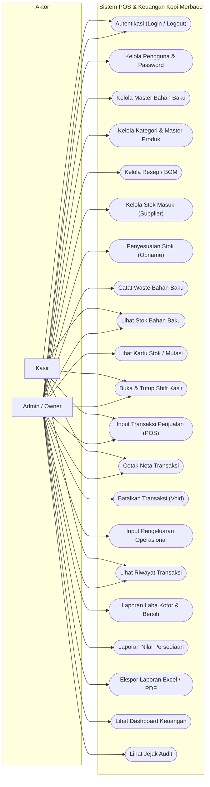
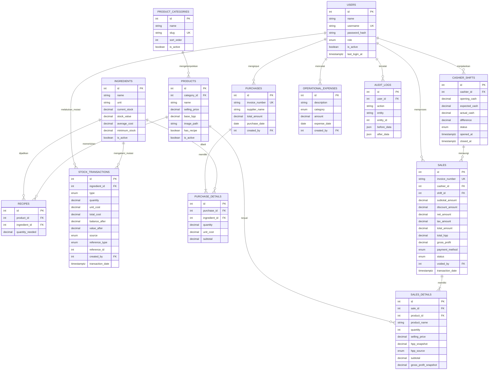
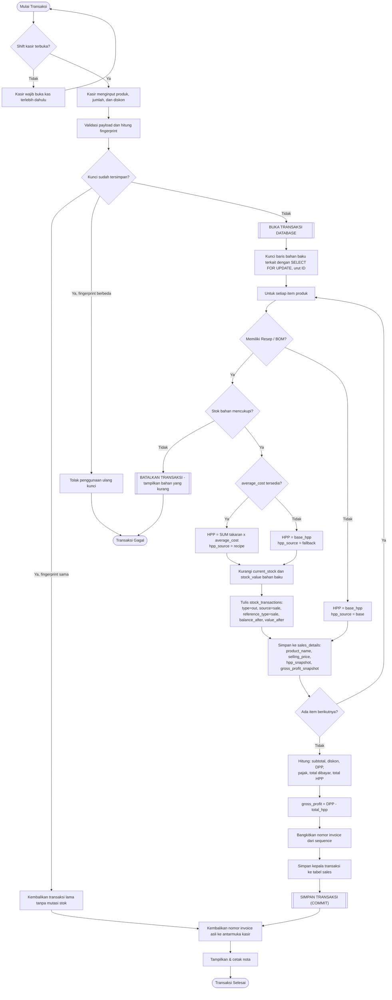
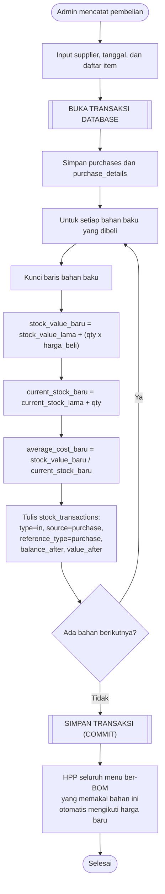
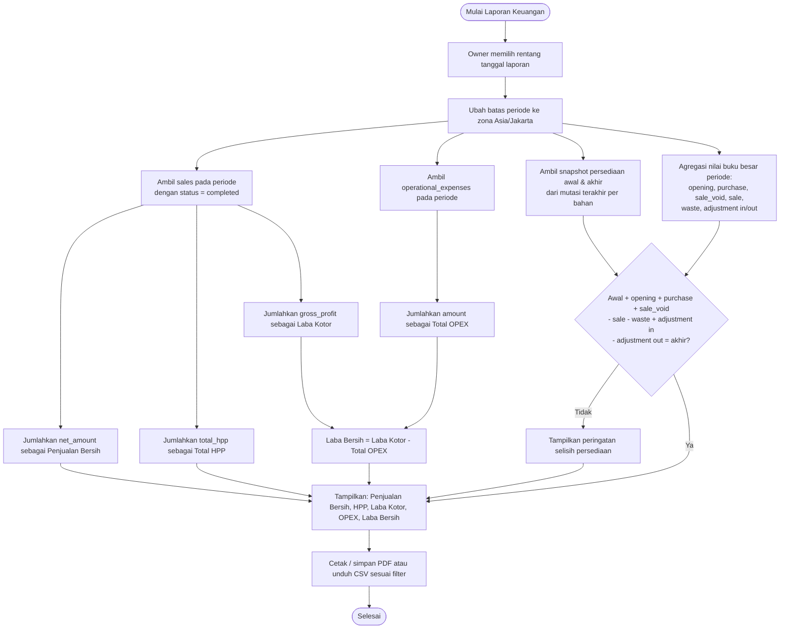
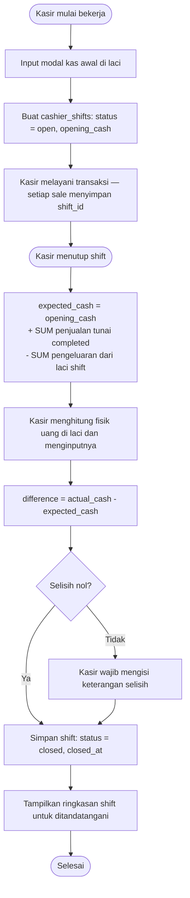

# DOKUMEN DESAIN SISTEM
## Rancang Bangun Aplikasi Web Pencatatan Transaksi & Analisis Laba (Kotor & Bersih)
### Studi Kasus: Kafe Kopi Merbaoe

---

## 1. PENDAHULUAN & RINGKASAN EKSEKUTIF

### 1.1 Latar Belakang

Kafe Kopi Merbaoe merupakan bisnis kuliner yang sedang berkembang. Dalam operasional sehari-hari, pencatatan transaksi penjualan, manajemen stok bahan baku, dan pemantauan pengeluaran operasional masih sering dilakukan secara manual atau terfragmentasi. Akibatnya, pemilik kafe (Owner) kesulitan dalam memantau kinerja keuangan secara *real-time*, khususnya terkait informasi **Laba Kotor (Gross Profit)** dan **Laba Bersih (Net Profit)**.

Untuk memenuhi kebutuhan akademis (Skripsi) sekaligus memberikan solusi bisnis yang konkret, dokumen ini merancang sebuah **Aplikasi Web Kasir (Point of Sale) & Analisis Keuangan** internal. Sistem ini terinspirasi dari fitur otomatisasi finansial pada platform **Olsera**, di mana HPP (Harga Pokok Penjualan) dipetakan secara dinamis berdasarkan pergerakan stok, dan laba dihitung secara otomatis saat transaksi terjadi.

### 1.2 Tujuan Dokumen Desain

Dokumen ini disusun untuk:

1. Menyediakan cetak biru (*blueprint*) arsitektur perangkat lunak dan basis data sistem.
2. Menetapkan kebijakan akuntansi yang menjadi dasar seluruh perhitungan finansial sistem.
3. Menjelaskan mekanisme matematis dan logis otomatisasi perhitungan Laba Kotor dan Laba Bersih.
4. Menetapkan kebutuhan non-fungsional, strategi pengujian, dan prosedur *deployment*.
5. Menjadi acuan tunggal bagi tim pengembang dalam tahap implementasi kode.

### 1.3 Ruang Lingkup & Batasan Sistem

**Termasuk dalam ruang lingkup:**

* Pencatatan transaksi penjualan (POS) dengan perhitungan HPP dan laba kotor otomatis.
* Manajemen persediaan bahan baku dengan metode **Weighted Average Perpetual** (rata-rata bergerak).
* Pencatatan pembelian bahan baku dari supplier.
* Pencatatan pengeluaran operasional non-persediaan.
* Pelaporan laba kotor, laba bersih, kartu stok, dan nilai persediaan akhir.
* Manajemen shift kasir (buka/tutup kas) beserta rekonsiliasi selisih.

**Di luar ruang lingkup (batasan sistem):**

* **Penggajian karyawan.** Sesuai permintaan klien, beban gaji tidak dicatat dalam sistem agar fokus pada arus barang masuk dan keluar.
* Integrasi *payment gateway* otomatis. Metode pembayaran QRIS dan transfer dicatat secara manual oleh kasir setelah pembayaran terverifikasi di luar sistem.
* Manajemen multi-cabang. Sistem dirancang untuk satu lokasi usaha.
* Perhitungan penyusutan aset tetap dan pelaporan pajak formal (SPT).
* Program loyalitas pelanggan dan manajemen data pelanggan.

### 1.4 Daftar Istilah

| Istilah | Definisi dalam Sistem Ini |
| :--- | :--- |
| **HPP / COGS** | Harga Pokok Penjualan. Nilai modal bahan baku yang melekat pada produk yang **terjual**. |
| **BOM** | *Bill of Materials* — daftar komposisi bahan baku beserta takarannya untuk satu porsi produk. |
| **Average Cost** | Harga perolehan rata-rata bergerak per satuan bahan baku. |
| **Stock Value** | Total nilai rupiah persediaan sebuah bahan baku yang masih tersimpan. |
| **Snapshot HPP** | Nilai HPP yang dibekukan pada baris detail penjualan saat transaksi diselesaikan. |
| **DPP** | Dasar Pengenaan Pajak — nilai penjualan setelah diskon, sebelum pajak. |
| **OPEX** | *Operational Expenditure* — beban operasional di luar pembelian bahan baku. |
| **Kartu Stok** | Riwayat kronologis seluruh mutasi masuk dan keluar sebuah bahan baku. |
| **Shift** | Satu periode kerja kasir, dari buka kas hingga tutup kas. |
| **Void** | Pembatalan transaksi penjualan yang telah tersimpan, disertai pembalikan stok. |
| **Kategori Menu** | Kelompok operasional dinamis untuk mengatur katalog, misalnya Kopi, Non Kopi, Makanan Berat, dan Cemilan. |

---

## 2. PERAN, KEBUTUHAN FUNGSIONAL & DAFTAR LAYAR

### 2.1 Matriks Peran & Kebutuhan Fungsional

Sistem membagi aksesibilitas menjadi dua peran utama untuk menjaga integritas data keuangan:

| Fitur / Modul | Admin / Owner | Kasir | Keterangan |
| :--- | :---: | :---: | :--- |
| **Autentikasi (Login/Logout)** | ✓ | ✓ | Sesi berbasis JWT dalam cookie `httpOnly`. |
| **Kelola Pengguna & Reset Password** | ✓ | — | Menambah kasir baru, menonaktifkan akun, mengganti password. |
| **Kelola Master Bahan Baku** | ✓ | — | Menentukan satuan dan stok minimal bahan baku. |
| **Kelola Master Menu/Produk** | ✓ | — | Mengatur kategori, nama, harga jual, HPP statis, foto, resep, urutan, dan status menu. |
| **Kelola Resep / BOM** | ✓ | — | Menyusun komposisi bahan baku per porsi produk. |
| **Kelola Stok Masuk (Supplier)** | ✓ | — | Menambah kuantitas bahan baku beserta harga beli. |
| **Penyesuaian Stok (Opname)** | ✓ | — | Mengoreksi selisih stok fisik terhadap stok sistem. |
| **Pencatatan Waste / Kerusakan** | ✓ | — | Mencatat bahan baku yang rusak, tumpah, atau kedaluwarsa. |
| **Lihat Stok Bahan Baku** | ✓ (Kelola) | ✓ (Hanya Baca) | Kasir dapat mengecek ketersediaan sebelum menjual. |
| **Lihat Kartu Stok (Mutasi)** | ✓ | — | Penelusuran riwayat keluar-masuk per bahan baku. |
| **Buka & Tutup Shift Kasir** | ✓ | ✓ | Pencatatan kas awal, kas akhir, dan selisih. |
| **Input Penjualan (POS)** | ✓ | ✓ | Kasir menginput item, jumlah, diskon, dan metode pembayaran. |
| **Cetak Nota Transaksi** | ✓ | ✓ | Struk termal 58mm/80mm. |
| **Pembatalan Transaksi (Void)** | ✓ | — | Membalikkan stok dan mengeluarkan transaksi dari laporan. |
| **Input Pengeluaran Operasional** | ✓ | — | Pengeluaran non-stok (listrik, sewa, air, dll. di luar gaji). |
| **Lihat Riwayat Transaksi** | ✓ (Semua) | ✓ (Milik Sendiri) | Kasir hanya melihat transaksi yang diinput sendiri. |
| **Laporan Laba Kotor & Bersih** | ✓ | — | Laporan periodik yang dapat difilter rentang tanggal. |
| **Laporan Nilai Persediaan** | ✓ | — | Nilai persediaan akhir per bahan baku pada tanggal tertentu. |
| **Ekspor Laporan (CSV/Cetak PDF)** | ✓ | — | CSV sesuai filter dan tampilan cetak yang dapat disimpan sebagai PDF browser; XLSX/PDF server ditunda. |
| **Dashboard Ringkasan** | ✓ | — | Grafik tren pendapatan, pengeluaran, dan alert stok tipis. |
| **Lihat Jejak Audit** | ✓ | — | Riwayat perubahan data master beserta pelakunya. |

### 2.2 Daftar Layar (Screen Inventory)

Daftar berikut menjadi acuan objektif untuk menilai kelengkapan implementasi. Sebuah modul dinyatakan selesai hanya bila seluruh layarnya tersedia dan berfungsi.

| Kode | Rute | Peran | Isi Layar |
| :--- | :--- | :---: | :--- |
| **L-01** | `/login` | Publik | Form username & password, penanganan pesan galat. |
| **L-02** | `/admin/dashboard` | Admin | Kartu ringkasan (pendapatan, HPP, laba kotor, OPEX, laba bersih), grafik tren 30 hari, panel stok menipis. |
| **L-03** | `/admin/ingredients` | Admin | Tabel bahan baku, form tambah/ubah, indikator stok menipis, kolom harga rata-rata & nilai persediaan. |
| **L-04** | `/admin/ingredients/[id]/card` | Admin | Kartu stok satu bahan baku: mutasi kronologis, saldo berjalan, filter tanggal. |
| **L-05** | `/admin/ingredients/adjustment` | Admin | Form penyesuaian stok (opname) dan pencatatan waste. |
| **L-06** | `/admin/products` | Admin | Tabel dan filter menu, form tambah/ubah, margin, foto, kategori, status aktif, serta panel/modal `Kelola Kategori`. |
| **L-07** | `/admin/products/[id]/recipe` | Admin | Penyusun resep (BOM): pilih bahan, tentukan takaran, pratinjau HPP dinamis terkini. |
| **L-08** | `/admin/purchases` | Admin | Form pembelian multi-item dan riwayat pembelian. |
| **L-09** | `/admin/expenses` | Admin | Form pengeluaran operasional dan riwayat berkategori. |
| **L-10** | `/admin/sales` | Admin | Riwayat seluruh penjualan, filter tanggal & kasir, aksi void. |
| **L-11** | `/admin/reports/profit` | Admin | Laporan laba kotor & bersih dengan filter rentang tanggal, tombol ekspor. |
| **L-12** | `/admin/reports/inventory` | Admin | Laporan nilai persediaan akhir per tanggal. |
| **L-13** | `/admin/shifts` | Admin | Daftar shift kasir beserta selisih kas. |
| **L-14** | `/admin/users` | Admin | Kelola akun pengguna dan reset password. |
| **L-15** | `/admin/audit` | Admin | Jejak audit perubahan data master. |
| **L-16** | `/cashier` | Kasir | Katalog menu dengan pencarian dan filter kategori, keranjang, diskon, metode bayar, kalkulator kembalian, checkout. |
| **L-17** | `/cashier/receipt/[id]` | Kasir | Pratinjau struk termal siap cetak. |
| **L-18** | `/cashier/history` | Kasir | Riwayat transaksi milik kasir yang sedang login. |
| **L-19** | `/cashier/stock` | Kasir | Tampilan stok bahan baku, hanya baca. |
| **L-20** | `/cashier/shift` | Admin & Kasir | Buka kas milik pengguna aktif, ringkasan shift berjalan, tutup kas. |

---

## 3. KEBIJAKAN AKUNTANSI & LOGIKA OTOMATISASI LABA

### 3.1 Kebijakan Dasar Akuntansi

Seluruh perhitungan dalam sistem ini tunduk pada tiga kebijakan berikut. Kebijakan ini bersifat mengikat bagi implementasi.

**A. Basis Akrual pada Harga Pokok Penjualan.**
Biaya bahan baku diakui sebagai beban **pada saat produk terjual**, bukan pada saat bahan baku dibeli. Konsekuensinya:

> **Pembelian bahan baku dari supplier BUKAN beban periode.** Pembelian adalah perpindahan bentuk aset — dari kas menjadi persediaan. Pembelian menaikkan nilai persediaan (`stock_value`) dan **tidak boleh dikurangkan dari laba** dalam bentuk apa pun.

Kesalahan yang paling sering terjadi pada sistem sejenis adalah mengurangkan total belanja supplier dari laba kotor. Hal itu menyebabkan biaya bahan baku terhitung dua kali, karena laba kotor sudah dikurangi HPP. Sistem ini secara tegas melarangnya.

**B. Pemisahan Persediaan dan Beban Operasional.**

| Jenis Pengeluaran | Tabel | Perlakuan |
| :--- | :--- | :--- |
| Pembelian bahan baku | `purchases` | Menambah persediaan. Mempengaruhi laba **hanya** ketika bahan terjual, melalui HPP. |
| Beban operasional (listrik, sewa, pemeliharaan, lain-lain) | `operational_expenses` | Beban periode. Langsung mengurangi laba bersih pada periode terjadinya. |

**C. Pajak Bukan Pendapatan.**
Pajak Restoran (PB1) yang dipungut dari pelanggan adalah kewajiban kepada pemerintah daerah, bukan pendapatan kafe. Pajak **dikeluarkan** dari perhitungan pendapatan maupun laba kotor.

### 3.2 Kebijakan Presisi & Pembulatan Uang

| Jenis Nilai | Tipe Data | Alasan |
| :--- | :--- | :--- |
| Nominal transaksi (subtotal, total, laba, beban) | `DECIMAL(14,2)` | Nilai selalu dibulatkan ke rupiah penuh (desimal `.00`). |
| Harga perolehan rata-rata per satuan (`average_cost`) | `DECIMAL(14,4)` | Bahan baku dihitung per gram/ml. Harga per satuan bisa bernilai pecahan kecil (mis. Rp 0,1234/ml). Presisi 4 desimal mencegah akumulasi galat pembulatan. |
| Nilai persediaan (`stock_value`) | `DECIMAL(14,2)` | Nilai agregat, disimpan dalam rupiah. |
| Kuantitas bahan baku | `DECIMAL(14,3)` | Mendukung takaran sekecil 0,001 satuan. |

**Aturan pembulatan:** pembulatan dilakukan dengan metode *round half up*, dan **hanya pada titik akhir perhitungan** (nilai yang disimpan ke `sales`, `sales_details`, dan laporan). Perhitungan antara wajib mempertahankan presisi penuh.

**Aturan tipe data di kode:** seluruh perhitungan finansial menggunakan tipe `Decimal` dari Prisma. Konversi ke `number` JavaScript hanya diperbolehkan pada lapisan tampilan, setelah nilai final tersimpan. Saat nilai melewati batas React Server Component ke Client Component, `Decimal` wajib dipetakan melalui DTO eksplisit menjadi string desimal yang serializable; dilarang memakai round-trip JSON generik atau melepas tipe menjadi `unknown`. Konversi string tersebut untuk kalkulasi/tampilan hanya dilakukan melalui utilitas terpusat di `src/lib/money.ts`.

### 3.3 Kebijakan Zona Waktu & Periode

Batas "hari" adalah definisi bisnis, bukan detail teknis. Server produksi berjalan pada UTC, sehingga penentuan periode wajib eksplisit.

* Seluruh kolom waktu disimpan sebagai `TIMESTAMPTZ` dalam UTC.
* Seluruh batas periode laporan dihitung pada zona waktu **`Asia/Jakarta` (WIB, UTC+7)**.
* **Hari operasional** didefinisikan sebagai pukul `00:00:00,000` hingga `23:59:59,999` WIB.
* **Bulan operasional** dimulai pada tanggal 1 pukul `00:00:00` WIB.
* Kolom bertipe `DATE` (`purchase_date`, `expense_date`) menyimpan tanggal kalender WIB tanpa komponen waktu.

### 3.4 Perhitungan Laba Kotor (Gross Profit)

Laba kotor dihitung dari **penjualan bersih (DPP)**, bukan dari total yang dibayar pelanggan.

Urutan perhitungan satu transaksi:

$$\text{Subtotal} = \sum_{i=1}^{n} (\text{Harga Jual}_i \times \text{Qty}_i)$$

$$\text{DPP (Penjualan Bersih)} = \text{Subtotal} - \text{Diskon}$$

$$\text{Pajak (PB1)} = \text{round}(\text{DPP} \times \text{Tarif Pajak})$$

$$\text{Total Dibayar Pelanggan} = \text{DPP} + \text{Pajak}$$

$$\text{Total HPP} = \sum_{i=1}^{n} (\text{HPP Snapshot}_i \times \text{Qty}_i)$$

$$\boxed{\text{Laba Kotor} = \text{DPP} - \text{Total HPP}}$$

Perhatikan bahwa **pajak tidak masuk ke dalam laba kotor** sesuai kebijakan §3.1.C, dan **diskon mengurangi pendapatan**, bukan menambah beban.

Tarif pajak disimpan per transaksi pada kolom `tax_rate` agar perubahan tarif di kemudian hari tidak mengubah nilai transaksi historis. Untuk kafe yang belum dikenakan PB1, tarif diisi `0`.

### 3.5 Metode Penentuan HPP — Hybrid COGS

HPP produk ditentukan dengan dua jalur:

**A. Static HPP.** Jika produk tidak memiliki resep (`has_recipe = false`) — misalnya produk titipan atau merchandise — HPP diambil dari nilai statis `base_hpp` pada master produk.

**B. Recipe-based Dynamic HPP.** Jika produk memiliki resep BOM, HPP dihitung dari akumulasi harga perolehan rata-rata bahan baku pembentuknya:

$$\text{HPP}_P = \sum_{i=1}^{n} \left( \text{Takaran}_i \times \text{AverageCost}_i \right)$$

### 3.6 Metode Average Costing — Weighted Average Perpetual

Sistem menggunakan metode **rata-rata bergerak tertimbang** yang diperbarui pada setiap mutasi stok. Nilai rata-rata **disimpan** pada tabel `ingredients`, bukan dihitung ulang dari riwayat setiap kali dibutuhkan. Pilihan ini diambil agar proses checkout kasir tetap cepat dan agar definisi rata-rata tidak berubah seiring bertambahnya data historis.

Dua kolom pendamping pada tabel `ingredients`:

| Kolom | Makna |
| :--- | :--- |
| `current_stock` | Kuantitas fisik yang tersisa. |
| `stock_value` | Total nilai rupiah dari kuantitas yang tersisa. |
| `average_cost` | Harga perolehan rata-rata per satuan = `stock_value ÷ current_stock`. |

#### A. Mutasi Masuk (pembelian, penyesuaian tambah)

$$\text{StockValue}_{baru} = \text{StockValue}_{lama} + (\text{Qty}_{masuk} \times \text{HargaBeli})$$
$$\text{Stock}_{baru} = \text{Stock}_{lama} + \text{Qty}_{masuk}$$
$$\text{AverageCost}_{baru} = \frac{\text{StockValue}_{baru}}{\text{Stock}_{baru}}$$

Harga rata-rata **berubah** setiap kali ada pembelian dengan harga berbeda.

#### B. Mutasi Keluar (penjualan, waste, penyesuaian kurang)

$$\text{Nilai Keluar} = \text{Qty}_{keluar} \times \text{AverageCost}_{saat\ ini}$$
$$\text{StockValue}_{baru} = \text{StockValue}_{lama} - \text{Nilai Keluar}$$
$$\text{Stock}_{baru} = \text{Stock}_{lama} - \text{Qty}_{keluar}$$

Harga rata-rata **tidak berubah** pada mutasi keluar. Inilah sifat khas metode rata-rata bergerak.

#### C. Aturan Nilai Awal & Kondisi Khusus

| Kondisi | Aturan |
| :--- | :--- |
| Bahan baku baru dibuat | `current_stock = 0`, `stock_value = 0`, `average_cost = 0`. |
| Stok awal (saldo pembukaan) | **Wajib** dicatat melalui transaksi penyesuaian bertipe masuk dengan harga perolehan yang ditetapkan admin. Stok tidak boleh diisi langsung tanpa nilai, karena akan membuat harga rata-rata tidak terdefinisi. |
| `current_stock = 0` | `stock_value` dipaksa menjadi `0`, `average_cost` mempertahankan nilai terakhir sebagai referensi harga. |
| `average_cost = 0` saat checkout produk ber-BOM | Sistem menggunakan `base_hpp` produk sebagai *fallback*, dan menandai baris penjualan tersebut dengan `hpp_source = 'fallback'` agar dapat ditelusuri di laporan. |
| Waste | Diperlakukan sebagai mutasi keluar biasa. Nilainya **tidak** masuk ke HPP, melainkan dicatat sebagai beban operasional kategori `lain_lain` secara otomatis. |

### 3.7 Mekanisme HPP Snapshotting

> **Penting.**
> Harga bahan baku berfluktuasi seiring waktu. Untuk menjaga keakuratan laporan keuangan historis, sistem **wajib** melakukan *snapshot* (pembekuan) nilai HPP pada tabel `sales_details` saat transaksi diselesaikan (`hpp_snapshot`). Jika di kemudian hari harga bahan baku naik, transaksi masa lalu tidak akan ikut berubah nilainya.

Snapshot yang dibekukan per baris penjualan mencakup `selling_price`, `hpp_snapshot`, dan `gross_profit_snapshot`. Laporan periodik **selalu** membaca nilai snapshot ini, tidak pernah menghitung ulang dari master produk.

### 3.8 Perhitungan Laba Bersih (Net Profit)

Laba bersih diperoleh dengan mengurangkan laba kotor dengan seluruh beban operasional pada periode yang sama:

$$\boxed{\text{Laba Bersih} = \text{Laba Kotor} - \text{Total OPEX}}$$

di mana:

$$\text{Laba Kotor} = \sum \text{gross\_profit dari tabel sales (status = completed)}$$
$$\text{Total OPEX} = \sum \text{amount dari tabel operational\_expenses}$$

**Klasifikasi Beban Operasional (OPEX).** Sesuai permintaan klien, pengeluaran untuk gaji karyawan tidak dimasukkan ke dalam sistem agar fokus pada pengeluaran dan pemasukan barang:

1. **Utilitas** — tagihan listrik, air, Wi-Fi, dan sampah.
2. **Sewa Tempat** — biaya sewa gedung, dapat diamortisasi bulanan.
3. **Pemeliharaan** — perbaikan mesin kopi, penggantian lampu, dan sejenisnya.
4. **Operasional Lain-lain** — biaya tak terduga, promosi, serta nilai *waste* bahan baku.

**Sumber data yang sah untuk laba bersih hanyalah tabel `operational_expenses`.** Tabel `purchases` tidak boleh menjadi pengurang laba dalam bentuk apa pun (lihat §3.1.A).

### 3.9 Laporan Nilai Persediaan Akhir

Laporan ini menjembatani selisih antara arus kas pembelian dan beban HPP, sekaligus menjadi alat verifikasi bahwa laba bersih dihitung dengan benar.

Untuk setiap bahan baku pada tanggal tertentu, nilai historis diambil dari baris
`stock_transactions` terakhir sebelum batas akhir hari WIB yang dipilih:

$$\text{Nilai Persediaan}_{i,t} = \text{value\_after pada mutasi terakhir}_{i,t}$$

Jika bahan belum pernah memiliki mutasi sebelum batas tersebut, stok dan nilainya dianggap
nol. Kolom `ingredients.current_stock`, `average_cost`, dan `stock_value` hanya mewakili
keadaan terkini dan **tidak boleh** dipakai untuk merekonstruksi tanggal lampau.

**Persamaan rekonsiliasi berbasis buku besar persediaan** yang wajib terpenuhi untuk setiap
periode:

$$
\begin{aligned}
\text{Persediaan}_{akhir} ={}& \text{Persediaan}_{awal}
+ \text{Opening}_{in}
+ \text{Pembelian}_{in}
+ \text{Void Penjualan}_{in} \\
&- \text{Penjualan}_{out}
- \text{Waste}_{out}
+ \text{Penyesuaian}_{in}
- \text{Penyesuaian}_{out}
\end{aligned}
$$

Seluruh komponen mutasi pada persamaan tersebut berasal dari `stock_transactions.total_cost`
menurut `source` dan `type`, bukan dari agregat tabel finansial. **HPP finansial** pada laporan
laba adalah jumlah `sales.total_hpp` untuk transaksi `completed`; sedangkan
**Penjualan\(_{out}\)** pada rekonsiliasi adalah nilai mutasi stok `source = sale` dan
`type = out`. Keduanya boleh berbeda ketika produk memakai HPP manual/fallback tanpa BOM:
produk itu tetap mempunyai beban HPP finansial, tetapi tidak boleh menciptakan mutasi bahan
baku fiktif. Ketidakcocokan pada persamaan buku besar di atas menandakan mutasi stok yang
tidak tercatat atau salah nilai dan menjadi indikator utama dalam pengujian sistem.

### 3.10 Simulasi Angka Perhitungan

#### A. Kondisi Persediaan Awal

| Bahan Baku | Stok | Nilai Persediaan | Harga Rata-rata |
| :--- | ---: | ---: | ---: |
| Biji Kopi | 1.000 gram | Rp 150.000 | Rp 150,0000 / gram |
| Susu Fresh Milk | 2.000 ml | Rp 40.000 | Rp 20,0000 / ml |
| Gula Aren | 500 ml | Rp 15.000 | Rp 30,0000 / ml |

#### B. Resep Menu "Kopi Susu Aren" (BOM)

| Bahan | Takaran | Harga Rata-rata | Nilai |
| :--- | ---: | ---: | ---: |
| Biji Kopi | 15 gram | Rp 150,0000 | Rp 2.250 |
| Susu Fresh Milk | 120 ml | Rp 20,0000 | Rp 2.400 |
| Gula Aren | 20 ml | Rp 30,0000 | Rp 600 |
| **Total HPP Dinamis** | | | **Rp 5.250** |

#### C. Transaksi Penjualan

Menu "Kopi Susu Aren" dijual seharga Rp 18.000, terjual 10 cup, tanpa diskon, tarif PB1 10%.

| Komponen | Perhitungan | Nilai |
| :--- | :--- | ---: |
| Subtotal | 10 × 18.000 | Rp 180.000 |
| Diskon | — | Rp 0 |
| **DPP (Penjualan Bersih)** | 180.000 − 0 | **Rp 180.000** |
| Pajak PB1 (10%) | 180.000 × 10% | Rp 18.000 |
| **Total Dibayar Pelanggan** | 180.000 + 18.000 | **Rp 198.000** |
| Total HPP Terkunci (Snapshot) | 10 × 5.250 | Rp 52.500 |
| **Laba Kotor** | 180.000 − 52.500 | **Rp 127.500** |

#### D. Mutasi Stok yang Tercatat Otomatis

| Bahan Baku | Qty Keluar | Nilai Keluar | Sisa Stok | Sisa Nilai | Harga Rata-rata |
| :--- | ---: | ---: | ---: | ---: | ---: |
| Biji Kopi | 150 gram | Rp 22.500 | 850 gram | Rp 127.500 | Rp 150,0000 |
| Susu Fresh Milk | 1.200 ml | Rp 24.000 | 800 ml | Rp 16.000 | Rp 20,0000 |
| Gula Aren | 200 ml | Rp 6.000 | 300 ml | Rp 9.000 | Rp 30,0000 |
| **Total** | | **Rp 52.500** | | | |

Total nilai keluar (Rp 52.500) cocok dengan Total HPP transaksi. Kecocokan ini adalah *invariant* yang wajib diuji.

#### E. Pengeluaran Operasional Hari Terkait

| Deskripsi | Kategori | Nilai |
| :--- | :--- | ---: |
| Listrik harian proporsional | Utilitas | Rp 30.000 |
| Biaya kebersihan & sampah | Utilitas | Rp 15.000 |
| **Total OPEX** | | **Rp 45.000** |

#### F. Laba Bersih Akhir Hari

$$\text{Laba Bersih} = \text{Rp } 127.500 - \text{Rp } 45.000 = \textbf{Rp 82.500}$$

Perhatikan bahwa pajak Rp 18.000 **tidak** muncul dalam perhitungan laba, karena merupakan kewajiban kepada pemerintah daerah.

#### G. Demonstrasi Rata-rata Bergerak & Snapshot

Keesokan harinya, kafe membeli 500 gram Biji Kopi seharga Rp 180 per gram.

| Langkah | Perhitungan | Hasil |
| :--- | :--- | ---: |
| Nilai persediaan baru | 127.500 + (500 × 180) | Rp 217.500 |
| Stok baru | 850 + 500 | 1.350 gram |
| **Harga rata-rata baru** | 217.500 ÷ 1.350 | **Rp 161,1111 / gram** |

HPP menu "Kopi Susu Aren" untuk penjualan **berikutnya** otomatis menjadi:

$$(15 \times 161{,}1111) + (120 \times 20) + (20 \times 30) = 2.416{,}67 + 2.400 + 600 = \textbf{Rp 5.417}$$

Sementara itu, transaksi kemarin **tetap** tercatat dengan `hpp_snapshot = Rp 5.250`. Inilah bukti bahwa mekanisme snapshot bekerja dan laporan historis tidak terdistorsi oleh perubahan harga.

### 3.11 Idempotensi Checkout

Setiap keranjang checkout memiliki satu `idempotency_key` berformat UUID yang dibuat di perangkat kasir. Kunci ini bukan nomor invoice dan tidak boleh dibuat ulang hanya karena permintaan mengalami timeout atau galat jaringan.

Aturan yang mengikat implementasi:

1. Kunci dibuat ketika keranjang mulai diisi dan dipertahankan selama retry dengan isi checkout yang sama.
2. Server memvalidasi payload, menyusun representasi kanonis (item diurutkan menurut `product_id`), lalu menyimpan SHA-256 payload pada `request_fingerprint`.
3. Permintaan pertama memproses penjualan, pengurangan stok, dan kartu stok dalam satu transaksi basis data.
4. Permintaan ulang dengan kunci dan fingerprint yang sama **tidak membuat transaksi baru dan tidak mengurangi stok lagi**; server mengembalikan ID, nomor invoice, dan nominal transaksi yang sudah tersimpan.
5. Kunci yang sama dengan fingerprint berbeda ditolak. Kunci juga tidak boleh dipakai ulang oleh kasir lain.
6. Batas `UNIQUE` pada `sales.idempotency_key` adalah pengaman terakhir untuk request bersamaan. Bila dua transaksi berlomba, transaksi yang kalah di-*rollback* seluruhnya lalu membaca dan mengembalikan hasil pemenang.
7. Antarmuka membuang kunci hanya setelah server mengonfirmasi sukses atau kasir sengaja mengosongkan keranjang. Galat yang hasil commit-nya belum pasti harus mempertahankan kunci agar aman untuk dicoba ulang.

### 3.12 Persistensi Keranjang Kasir

Keranjang yang belum di-*checkout* dipertahankan di `sessionStorage` agar tidak hilang
ketika halaman dimuat ulang atau kasir berpindah layar dalam tab yang sama. Persistensi
ini hanya bantuan pemulihan antarmuka, bukan sumber kebenaran transaksi.

Aturan yang mengikat implementasi:

1. Kunci penyimpanan dipisahkan menurut ID kasir dan ID shift aktif.
2. Payload hanya menyimpan versi format, waktu simpan, `product_id`, dan kuantitas;
   harga, resep, stok, diskon, pajak, metode pembayaran, dan uang diterima tidak disimpan.
3. Saat dipulihkan, item harus direkonsiliasi dengan katalog aktif serta stok resep
   terbaru dari server. Menu yang tidak tersedia dibuang dan kuantitas dibatasi menurut
   stok yang masih dapat dipenuhi.
4. Keranjang kedaluwarsa setelah delapan jam. Keranjang dari shift lama milik kasir yang
   sama dibersihkan saat layar kasir dibuka.
5. Keranjang dihapus setelah *checkout* berhasil atau kasir memilih “Kosongkan Keranjang”.
6. Kegagalan akses/kuota penyimpanan browser tidak boleh memblokir transaksi; POS tetap
   berfungsi dengan state memori pada sesi berjalan.

---

## 4. ARSITEKTUR TEKNOLOGI

### 4.1 Tumpukan Teknologi

Untuk skripsi berbasis web yang cepat selesai, memiliki performa tinggi, modern, mudah didemonstrasikan, dan dapat di-*deploy* secara gratis, digunakan arsitektur *serverless* dan *fullstack* TypeScript berikut:

| Lapisan | Teknologi | Alasan Pemilihan |
| :--- | :--- | :--- |
| **Framework** | Next.js 16 (App Router) + TypeScript | Sisi klien (UI kasir/dashboard) dan sisi server (logika HPP, stok, autentikasi) berada dalam satu basis kode. Server Actions menghilangkan kebutuhan menulis lapisan API terpisah. |
| **Basis Data** | PostgreSQL pada Supabase (Free Tier) | Mendukung transaksi ACID, *foreign key*, dan tipe `DECIMAL` presisi tinggi — syarat mutlak untuk konsistensi data keuangan. |
| **ORM** | Prisma ORM v7 | Menyediakan *type safety* otomatis dari skema ke kode TypeScript, migrasi terversi melalui Prisma Migrate, dan transaksi interaktif. |
| **Autentikasi** | JWT (`jose`) + `bcryptjs` | Sesi *stateless* dalam cookie `httpOnly`, cocok untuk lingkungan serverless. |
| **Deployment** | Vercel + Supabase Cloud | Integrasi CI/CD otomatis via GitHub, tersedia tingkat gratis yang memadai untuk demo skripsi dan uji coba klien. |

### 4.2 Struktur Direktori

```
merbaoe/
├── prisma/
│   ├── schema.prisma           # Sumber kebenaran skema basis data
│   ├── migrations/             # Migrasi terversi
│   └── seed.ts                 # Data awal (pengguna, bahan, menu, resep)
├── src/
│   ├── app/
│   │   ├── login/              # L-01
│   │   ├── admin/              # L-02 s.d. L-15
│   │   └── cashier/            # L-16 s.d. L-20
│   ├── lib/
│   │   ├── prisma.ts           # Singleton PrismaClient
│   │   ├── auth.ts             # Pembuatan & verifikasi sesi JWT
│   │   ├── guard.ts            # requireAuth() / requireAdmin()
│   │   ├── money.ts            # Pembulatan & format rupiah
│   │   ├── dto.ts              # DTO serializable untuk boundary server/client
│   │   ├── period.ts           # Batas periode zona Asia/Jakarta
│   │   └── costing.ts          # Perhitungan average cost & HPP
│   └── proxy.ts                # Proteksi rute tingkat request
└── docs/                       # Dokumen pendukung
```

### 4.3 Lapisan Otorisasi

Otorisasi ditegakkan pada **tiga lapisan** yang saling melengkapi. Ketiganya wajib ada.

| Lapisan | Berkas | Fungsi |
| :--- | :--- | :--- |
| **1. Proxy (tingkat request)** | `src/proxy.ts` | Pemeriksaan optimistik. Mengalihkan pengunjung tanpa sesi ke `/login` dan kasir yang membuka `/admin/*` ke `/cashier`. Bersifat cepat namun **tidak boleh** menjadi satu-satunya pengaman. |
| **2. Layout (tingkat halaman)** | `admin/layout.tsx`, `cashier/layout.tsx` | Memverifikasi sesi dan peran sebelum halaman dirender. |
| **3. Server Action (tingkat aksi)** | Setiap fungsi `"use server"` | **Wajib** memanggil `requireAdmin()` atau `requireAuth()` pada baris pertama. Server Action dipanggil berdasarkan identitas aksi, bukan berdasarkan alamat halaman, sehingga pemeriksaan di lapisan 1 dan 2 tidak menjangkaunya. Lapisan ini adalah pengaman sesungguhnya. |

> **Catatan konvensi Next.js 16:** berkas `middleware.ts` telah digantikan oleh `proxy.ts`, dengan fungsi diekspor bernama `proxy`. Perilakunya identik.

---

## 5. SKEMA BASIS DATA (POSTGRESQL)

Seluruh DDL di bawah ditulis dalam sintaks PostgreSQL, sesuai basis data yang digunakan. Skema Prisma pada §5.15 merupakan representasi yang sama dan menjadi sumber kebenaran bagi migrasi.

### 5.1 Tipe Enumerasi

Nama tipe mengikuti penamaan yang dibangkitkan Prisma dari §5.15, sehingga DDL ini dan skema Prisma menghasilkan struktur yang identik.

```sql
CREATE TYPE "Role"            AS ENUM ('admin', 'kasir');
CREATE TYPE "PaymentMethod"   AS ENUM ('cash', 'qris', 'transfer');
CREATE TYPE "ExpenseCategory" AS ENUM ('utilitas', 'sewa', 'pemeliharaan', 'lain_lain');
CREATE TYPE "TransactionType" AS ENUM ('in', 'out');
CREATE TYPE "StockSource"     AS ENUM ('purchase', 'sale', 'sale_void', 'adjustment', 'waste', 'opening');
CREATE TYPE "ReferenceType"   AS ENUM ('purchase', 'sale', 'adjustment');
CREATE TYPE "SaleStatus"      AS ENUM ('completed', 'voided');
CREATE TYPE "ShiftStatus"     AS ENUM ('open', 'closed');
CREATE TYPE "HppSource"       AS ENUM ('recipe', 'base', 'fallback');
```

### 5.2 Tabel `users`

Menampung data akun pengguna sistem.

```sql
CREATE TABLE users (
    id            SERIAL PRIMARY KEY,
    name          VARCHAR(100) NOT NULL,
    username      VARCHAR(50)  NOT NULL UNIQUE,
    password_hash VARCHAR(255) NOT NULL,
    role          "Role"       NOT NULL,
    is_active     BOOLEAN      NOT NULL DEFAULT TRUE,
    session_version INTEGER    NOT NULL DEFAULT 1,
    last_login_at TIMESTAMPTZ,
    created_at    TIMESTAMPTZ  NOT NULL DEFAULT NOW(),
    updated_at    TIMESTAMPTZ  NOT NULL DEFAULT NOW(),

    CONSTRAINT users_session_version_check CHECK (session_version >= 1)
);
```

Akun tidak pernah dihapus, hanya dinonaktifkan (`is_active = FALSE`), agar riwayat transaksi yang menunjuk ke akun tersebut tetap utuh. `session_version` disalin ke JWT dan dinaikkan setiap kali password direset atau status akun berubah; guard server menolak JWT dengan versi lama maupun akun nonaktif.

#### 5.2.1 Tabel `login_attempts`

Menyimpan throttle login per username secara bersama di database, sehingga batas tetap
berlaku pada lebih dari satu proses aplikasi dan tidak bergantung pada memori server.

```sql
CREATE TABLE login_attempts (
    username          VARCHAR(50) PRIMARY KEY,
    failed_count      INTEGER     NOT NULL DEFAULT 0,
    window_started_at TIMESTAMPTZ NOT NULL,
    blocked_until     TIMESTAMPTZ,
    updated_at        TIMESTAMPTZ NOT NULL,

    CONSTRAINT login_attempts_failed_count_check
        CHECK (failed_count BETWEEN 0 AND 5)
);

CREATE INDEX login_attempts_updated_at_idx ON login_attempts (updated_at);
```

Baris lama dibersihkan secara oportunistik. Username yang tidak terdaftar tetap memperoleh
baris throttle dan tetap melewati `bcrypt.compare` dengan dummy hash cost 10, sehingga
pesan maupun jalur waktu tidak mengungkap keberadaan akun.

### 5.3 Tabel `ingredients` (Bahan Baku)

Menyimpan data stok mentah beserta nilai persediaannya.

```sql
CREATE TABLE ingredients (
    id            SERIAL PRIMARY KEY,
    name          VARCHAR(100)   NOT NULL,
    unit          VARCHAR(20)    NOT NULL,          -- 'gram', 'ml', 'pcs'
    current_stock DECIMAL(14,3)  NOT NULL DEFAULT 0,
    stock_value   DECIMAL(14,2)  NOT NULL DEFAULT 0, -- total nilai rupiah persediaan
    average_cost  DECIMAL(14,4)  NOT NULL DEFAULT 0, -- stock_value / current_stock
    minimum_stock DECIMAL(14,3)  NOT NULL DEFAULT 0, -- ambang notifikasi stok menipis
    is_active     BOOLEAN        NOT NULL DEFAULT TRUE,
    created_at    TIMESTAMPTZ    NOT NULL DEFAULT NOW(),
    updated_at    TIMESTAMPTZ    NOT NULL DEFAULT NOW(),

    CONSTRAINT ingredients_stock_non_negative CHECK (current_stock >= 0),
    CONSTRAINT ingredients_value_non_negative CHECK (stock_value   >= 0)
);
```

Dua `CHECK` di atas adalah pengaman terakhir terhadap kondisi balapan (*race condition*) pada transaksi bersamaan.

### 5.4 Tabel `product_categories` dan `products` (Kategori & Menu)

Kategori merupakan data master dinamis, bukan enum atau teks bebas pada produk. Dengan
demikian admin dapat menambah kategori baru tanpa migrasi skema, sementara variasi ejaan
seperti `Non Kopi`, `non kopi`, dan `Non-Kopi` tidak memecah katalog menjadi kelompok semu.

```sql
CREATE TABLE product_categories (
    id         SERIAL PRIMARY KEY,
    name       VARCHAR(80) NOT NULL,
    slug       VARCHAR(80) NOT NULL UNIQUE,
    sort_order INTEGER     NOT NULL DEFAULT 0,
    is_active  BOOLEAN     NOT NULL DEFAULT TRUE,
    created_at TIMESTAMPTZ NOT NULL DEFAULT NOW(),
    updated_at TIMESTAMPTZ NOT NULL DEFAULT NOW(),

    CONSTRAINT product_categories_sort_non_negative CHECK (sort_order >= 0)
);

CREATE INDEX idx_product_categories_catalog
    ON product_categories (is_active, sort_order, name);
```

`slug` dibangkitkan dan divalidasi server sebagai identitas stabil; admin hanya mengelola
nama tampilan dan urutannya. Kategori dinonaktifkan, bukan dihapus keras. Sistem menolak
penonaktifan kategori yang masih mempunyai produk aktif sampai produk tersebut dipindahkan
atau dinonaktifkan.

```sql
CREATE TABLE products (
    id            SERIAL PRIMARY KEY,
    category_id   INTEGER       NOT NULL REFERENCES product_categories(id) ON DELETE RESTRICT,
    name          VARCHAR(100)  NOT NULL,
    selling_price DECIMAL(14,2) NOT NULL,
    base_hpp      DECIMAL(14,2) NOT NULL DEFAULT 0,  -- HPP statis, juga menjadi fallback
    image_path    VARCHAR(255),                         -- path foto asli opsional di Storage
    has_recipe    BOOLEAN       NOT NULL DEFAULT FALSE,
    is_active     BOOLEAN       NOT NULL DEFAULT TRUE,
    created_at    TIMESTAMPTZ   NOT NULL DEFAULT NOW(),
    updated_at    TIMESTAMPTZ   NOT NULL DEFAULT NOW(),

    CONSTRAINT products_price_non_negative CHECK (selling_price >= 0),
    CONSTRAINT products_hpp_non_negative   CHECK (base_hpp      >= 0)
);

CREATE INDEX idx_products_category_active
    ON products (category_id, is_active);
```

Kolom `has_recipe` **tidak diisi manual**. Sistem memperbaruinya secara otomatis menjadi `TRUE` ketika resep pertama ditambahkan, dan `FALSE` ketika resep terakhir dihapus.

Setiap menu wajib berada tepat pada satu kategori. Relasi `ON DELETE RESTRICT` menjaga
produk lama tetap dapat ditelusuri. Kategori adalah alat organisasi katalog dan tidak
mengubah perhitungan HPP, stok, pajak, maupun snapshot transaksi.

`image_path` menyimpan path objek, bukan data gambar atau URL bertanda tangan. Foto menu
bersifat opsional, memakai foto produk asli berasio 4:3, dan disimpan pada bucket publik
Supabase Storage `menu-images`. Antarmuka wajib menyediakan fallback tipografis ketika
foto belum tersedia atau gagal dimuat. Foto stok dan gambar generatif tidak dipakai sebagai
data contoh. Format yang diterima adalah JPEG, PNG, atau WebP dengan ukuran maksimum 3 MiB.

### 5.5 Tabel `recipes` (BOM — Bill of Materials)

Menghubungkan produk dengan bahan baku penyusunnya.

```sql
CREATE TABLE recipes (
    id              SERIAL PRIMARY KEY,
    product_id      INTEGER       NOT NULL REFERENCES products(id)    ON DELETE CASCADE,
    ingredient_id   INTEGER       NOT NULL REFERENCES ingredients(id) ON DELETE RESTRICT,
    quantity_needed DECIMAL(14,3) NOT NULL,  -- takaran per satu porsi produk

    CONSTRAINT recipes_qty_positive CHECK (quantity_needed > 0),
    CONSTRAINT recipes_unique_pair  UNIQUE (product_id, ingredient_id)
);
```

Batasan `UNIQUE (product_id, ingredient_id)` mencegah satu bahan baku tercatat dua kali dalam satu resep, yang akan menggandakan HPP.

### 5.6 Tabel `stock_transactions` (Kartu Stok)

Mencatat seluruh mutasi keluar masuk bahan baku. Tabel ini bersifat *append-only* — baris yang sudah tertulis tidak pernah diubah atau dihapus.

```sql
CREATE TABLE stock_transactions (
    id               SERIAL PRIMARY KEY,
    ingredient_id    INTEGER          NOT NULL REFERENCES ingredients(id) ON DELETE RESTRICT,
    type             "TransactionType" NOT NULL,
    quantity         DECIMAL(14,3)    NOT NULL,
    unit_cost        DECIMAL(14,4)    NOT NULL DEFAULT 0,  -- harga per satuan pada mutasi ini
    total_cost       DECIMAL(14,2)    NOT NULL DEFAULT 0,  -- quantity * unit_cost
    balance_after    DECIMAL(14,3)    NOT NULL,            -- saldo stok setelah mutasi
    value_after      DECIMAL(14,2)    NOT NULL,            -- nilai persediaan setelah mutasi
    source           "StockSource"     NOT NULL,
    reference_type   "ReferenceType",                      -- penanda tabel tujuan reference_id
    reference_id     INTEGER,
    notes            VARCHAR(255),
    created_by       INTEGER          NOT NULL REFERENCES users(id),
    transaction_date TIMESTAMPTZ      NOT NULL DEFAULT NOW(),

    CONSTRAINT stock_tx_qty_positive CHECK (quantity > 0),
    CONSTRAINT stock_tx_reference_pair CHECK (
        (reference_type IS NULL     AND reference_id IS NULL) OR
        (reference_type IS NOT NULL AND reference_id IS NOT NULL)
    )
);
```

Tiga keputusan desain penting pada tabel ini:

* **`reference_type` mendampingi `reference_id`.** Tanpa penanda tipe, angka `12` pada `reference_id` bersifat ambigu — bisa merujuk `purchases.id` atau `sales.id`. Pasangan kedua kolom ini membuat relasi dapat ditelusuri dengan pasti.
* **`balance_after` dan `value_after` disimpan.** Kartu stok dapat menampilkan saldo berjalan tanpa menghitung ulang seluruh riwayat, dan setiap baris menjadi bukti audit yang berdiri sendiri.
* **`created_by` wajib diisi.** Setiap mutasi stok dapat dipertanggungjawabkan kepada pengguna tertentu.

### 5.7 Tabel `purchases` (Pengadaan Bahan Baku)

```sql
CREATE TABLE purchases (
    id             SERIAL PRIMARY KEY,
    invoice_number VARCHAR(50)   NOT NULL UNIQUE,
    supplier_name  VARCHAR(100),
    total_amount   DECIMAL(14,2) NOT NULL,
    purchase_date  DATE          NOT NULL,
    notes          VARCHAR(255),
    created_by     INTEGER       NOT NULL REFERENCES users(id),
    created_at     TIMESTAMPTZ   NOT NULL DEFAULT NOW(),

    CONSTRAINT purchases_total_non_negative CHECK (total_amount >= 0)
);
```

### 5.8 Tabel `purchase_details`

```sql
CREATE TABLE purchase_details (
    id            SERIAL PRIMARY KEY,
    purchase_id   INTEGER       NOT NULL REFERENCES purchases(id)   ON DELETE CASCADE,
    ingredient_id INTEGER       NOT NULL REFERENCES ingredients(id) ON DELETE RESTRICT,
    quantity      DECIMAL(14,3) NOT NULL,
    unit_cost     DECIMAL(14,4) NOT NULL,
    subtotal      DECIMAL(14,2) NOT NULL,

    CONSTRAINT purchase_details_qty_positive  CHECK (quantity  > 0),
    CONSTRAINT purchase_details_cost_positive CHECK (unit_cost >= 0)
);
```

### 5.9 Tabel `cashier_shifts` (Shift Kasir)

Mencatat periode kerja kasir beserta rekonsiliasi kas.

```sql
CREATE TABLE cashier_shifts (
    id             SERIAL PRIMARY KEY,
    cashier_id     INTEGER       NOT NULL REFERENCES users(id),
    opening_cash   DECIMAL(14,2) NOT NULL DEFAULT 0,  -- modal kas awal di laci
    expected_cash  DECIMAL(14,2),                     -- kas awal + tunai - pengeluaran laci
    actual_cash    DECIMAL(14,2),                     -- hasil hitung fisik saat tutup
    difference     DECIMAL(14,2),                     -- actual_cash - expected_cash
    status         "ShiftStatus" NOT NULL DEFAULT 'open',
    notes          VARCHAR(255),
    opened_at      TIMESTAMPTZ   NOT NULL DEFAULT NOW(),
    closed_at      TIMESTAMPTZ
);

-- Satu kasir hanya boleh memiliki satu shift terbuka pada satu waktu.
CREATE UNIQUE INDEX cashier_shifts_one_open
    ON cashier_shifts (cashier_id) WHERE status = 'open';
```

### 5.10 Tabel `sales` (Transaksi Penjualan)

```sql
CREATE TABLE sales (
    id               SERIAL PRIMARY KEY,
    invoice_number   VARCHAR(50)    NOT NULL UNIQUE,
    idempotency_key  UUID           NOT NULL UNIQUE,
    request_fingerprint CHAR(64)    NOT NULL,
    cashier_id       INTEGER        NOT NULL REFERENCES users(id),
    shift_id         INTEGER        NOT NULL REFERENCES cashier_shifts(id),

    subtotal_amount  DECIMAL(14,2)  NOT NULL,          -- sum(selling_price * qty)
    discount_amount  DECIMAL(14,2)  NOT NULL DEFAULT 0,
    net_amount       DECIMAL(14,2)  NOT NULL,          -- DPP = subtotal - discount
    tax_rate         DECIMAL(5,4)   NOT NULL DEFAULT 0,-- mis. 0.1000 untuk PB1 10%
    tax_amount       DECIMAL(14,2)  NOT NULL DEFAULT 0,
    total_amount     DECIMAL(14,2)  NOT NULL,          -- yang dibayar pelanggan = net + tax

    total_hpp        DECIMAL(14,2)  NOT NULL,
    gross_profit     DECIMAL(14,2)  NOT NULL,          -- net_amount - total_hpp

    payment_method   "PaymentMethod" NOT NULL,
    cash_received    DECIMAL(14,2),                    -- diisi bila pembayaran tunai
    change_amount    DECIMAL(14,2),                    -- cash_received - total_amount

    status           "SaleStatus"   NOT NULL DEFAULT 'completed',
    void_reason      VARCHAR(255),
    voided_by        INTEGER        REFERENCES users(id),
    voided_at        TIMESTAMPTZ,

    transaction_date TIMESTAMPTZ    NOT NULL DEFAULT NOW(),

    CONSTRAINT sales_discount_valid CHECK (discount_amount >= 0 AND discount_amount <= subtotal_amount),
    CONSTRAINT sales_net_valid      CHECK (net_amount   = subtotal_amount - discount_amount),
    CONSTRAINT sales_total_valid    CHECK (total_amount = net_amount + tax_amount),
    CONSTRAINT sales_profit_valid   CHECK (gross_profit = net_amount - total_hpp),
    CONSTRAINT sales_fingerprint_valid CHECK (request_fingerprint ~ '^[0-9a-f]{64}$'),
    CONSTRAINT sales_void_complete  CHECK (
        (status = 'completed' AND voided_at IS NULL     AND voided_by IS NULL) OR
        (status = 'voided'    AND voided_at IS NOT NULL AND voided_by IS NOT NULL)
    )
);
```

Empat `CHECK` aritmetika di atas memaksa konsistensi rumus §3.4 pada tingkat basis data. Baris yang melanggar rumus tidak akan pernah tersimpan, sekalipun terdapat kekeliruan pada kode aplikasi.

**Format nomor invoice.** Nomor dibangkitkan dari *sequence* PostgreSQL agar bebas dari tabrakan pada transaksi bersamaan:

```sql
CREATE SEQUENCE sales_invoice_seq;
-- Contoh hasil: TRX-20260822-00001
-- 'TRX-' || to_char(NOW() AT TIME ZONE 'Asia/Jakarta', 'YYYYMMDD')
--        || '-' || lpad(nextval('sales_invoice_seq')::text, 5, '0')
```

Nomor yang tersimpan **wajib dikembalikan dari server ke antarmuka kasir**, agar nomor pada struk identik dengan nomor pada basis data.

### 5.11 Tabel `sales_details`

```sql
CREATE TABLE sales_details (
    id                    SERIAL PRIMARY KEY,
    sale_id               INTEGER       NOT NULL REFERENCES sales(id)    ON DELETE CASCADE,
    product_id            INTEGER       NOT NULL REFERENCES products(id) ON DELETE RESTRICT,
    product_name          VARCHAR(100)  NOT NULL,  -- snapshot nama saat transaksi
    quantity              INTEGER       NOT NULL,
    selling_price         DECIMAL(14,2) NOT NULL,  -- snapshot harga jual
    hpp_snapshot          DECIMAL(14,2) NOT NULL,  -- HPP per unit, TERKUNCI
    hpp_source            "HppSource"   NOT NULL,  -- asal nilai HPP untuk penelusuran
    subtotal              DECIMAL(14,2) NOT NULL,  -- selling_price * quantity
    gross_profit_snapshot DECIMAL(14,2) NOT NULL,  -- (selling_price - hpp_snapshot) * quantity

    CONSTRAINT sales_details_qty_positive CHECK (quantity > 0)
);
```

Kolom `product_name` dibekukan bersama harga dan HPP. Dengan demikian, struk dan laporan historis tetap terbaca benar meskipun nama menu diubah di kemudian hari.

### 5.12 Tabel `operational_expenses` (Pengeluaran Operasional)

```sql
CREATE TABLE operational_expenses (
    id           SERIAL PRIMARY KEY,
    description  VARCHAR(255)     NOT NULL,
    category     "ExpenseCategory" NOT NULL,
    amount       DECIMAL(14,2)    NOT NULL,
    expense_date DATE             NOT NULL,
    created_by   INTEGER          NOT NULL REFERENCES users(id),
    cashier_shift_id INTEGER      REFERENCES cashier_shifts(id) ON DELETE RESTRICT,
    stock_transaction_id INTEGER  UNIQUE REFERENCES stock_transactions(id) ON DELETE RESTRICT,
    created_at   TIMESTAMPTZ      NOT NULL DEFAULT NOW(),

    CONSTRAINT expenses_amount_positive CHECK (
      amount > 0 OR (amount = 0 AND stock_transaction_id IS NOT NULL)
    )
);
```

`cashier_shift_id` hanya diisi bila biaya benar-benar dibayar memakai uang
fisik dari laci shift tersebut. Biaya melalui rekening, transfer, atau uang di
luar laci membiarkan kolom ini `NULL`. Pengeluaran yang sudah menjadi bagian
rekonsiliasi shift tertutup tidak boleh dihapus.

`stock_transaction_id` hanya diisi oleh beban otomatis hasil waste. Relasi ini
membuat beban dapat ditelusuri ke kartu stok asalnya dan mencegah penghapusan
manual melalui L-09. Waste bernilai nol tetap dicatat bila bahan mempunyai stok
dengan `average_cost = 0`; pengeluaran manual tetap wajib lebih besar dari nol.

### 5.13 Tabel `audit_logs` (Jejak Audit)

Mencatat perubahan data master, mendukung klaim auditabilitas sistem.

```sql
CREATE TABLE audit_logs (
    id          SERIAL PRIMARY KEY,
    user_id     INTEGER     NOT NULL REFERENCES users(id),
    action      VARCHAR(20) NOT NULL,   -- 'create', 'update', 'delete', 'void'
    entity      VARCHAR(50) NOT NULL,   -- 'ingredient', 'product', 'recipe', 'sale', ...
    entity_id   INTEGER     NOT NULL,
    before_data JSONB,
    after_data  JSONB,
    created_at  TIMESTAMPTZ NOT NULL DEFAULT NOW()
);
```

### 5.14 Indeks

PostgreSQL tidak membuat indeks otomatis untuk kolom *foreign key*. Indeks berikut wajib dibuat agar kueri laporan tidak melakukan pemindaian tabel penuh.

```sql
-- Penjualan: laporan periodik & filter kasir
CREATE INDEX idx_sales_date          ON sales (transaction_date);
CREATE INDEX idx_sales_cashier_date  ON sales (cashier_id, transaction_date);
CREATE INDEX idx_sales_status_date   ON sales (status, transaction_date);
CREATE INDEX idx_sales_shift         ON sales (shift_id);

-- Detail penjualan: agregasi produk terlaris
CREATE INDEX idx_sale_details_sale    ON sales_details (sale_id);
CREATE INDEX idx_sale_details_product ON sales_details (product_id);

-- Kartu stok: penelusuran per bahan baku
CREATE INDEX idx_stock_tx_ingredient_date ON stock_transactions (ingredient_id, transaction_date);
CREATE INDEX idx_stock_tx_reference       ON stock_transactions (reference_type, reference_id);

-- Pembelian & pengeluaran: laporan periodik
CREATE INDEX idx_purchases_date        ON purchases (purchase_date);
CREATE INDEX idx_purchase_details_purchase   ON purchase_details (purchase_id);
CREATE INDEX idx_purchase_details_ingredient ON purchase_details (ingredient_id);
CREATE INDEX idx_expenses_date         ON operational_expenses (expense_date);
CREATE INDEX idx_expenses_category_date ON operational_expenses (category, expense_date);
CREATE INDEX idx_expenses_shift        ON operational_expenses (cashier_shift_id);

-- Resep & audit
CREATE INDEX idx_recipes_product     ON recipes (product_id);
CREATE INDEX idx_recipes_ingredient  ON recipes (ingredient_id);
CREATE INDEX idx_audit_entity        ON audit_logs (entity, entity_id);
CREATE INDEX idx_audit_user_date     ON audit_logs (user_id, created_at);
```

### 5.15 Prisma Schema Model (`schema.prisma`)

Berkas berikut adalah sumber kebenaran skema. Migrasi dibangkitkan darinya melalui `prisma migrate`.

```prisma
generator client {
  provider = "prisma-client"
  output   = "../src/generated/prisma"
}

datasource db {
  provider = "postgresql"
}

enum Role {
  admin
  kasir
}

enum PaymentMethod {
  cash
  qris
  transfer
}

enum ExpenseCategory {
  utilitas
  sewa
  pemeliharaan
  lain_lain
}

enum TransactionType {
  in
  out
}

enum StockSource {
  purchase
  sale
  sale_void
  adjustment
  waste
  opening
}

enum ReferenceType {
  purchase
  sale
  adjustment
}

enum SaleStatus {
  completed
  voided
}

enum ShiftStatus {
  open
  closed
}

enum HppSource {
  recipe
  base
  fallback
}

model User {
  id                  Int                  @id @default(autoincrement())
  name                String               @db.VarChar(100)
  username            String               @unique @db.VarChar(50)
  passwordHash        String               @map("password_hash") @db.VarChar(255)
  role                Role
  isActive            Boolean              @default(true) @map("is_active")
  lastLoginAt         DateTime?            @map("last_login_at") @db.Timestamptz(3)
  createdAt           DateTime             @default(now()) @map("created_at") @db.Timestamptz(3)
  updatedAt           DateTime             @updatedAt @map("updated_at") @db.Timestamptz(3)

  purchases           Purchase[]
  sales               Sale[]               @relation("SaleCashier")
  voidedSales         Sale[]               @relation("SaleVoidedBy")
  operationalExpenses OperationalExpense[]
  stockTransactions   StockTransaction[]
  shifts              CashierShift[]
  auditLogs           AuditLog[]

  @@map("users")
}

model Ingredient {
  id                Int                @id @default(autoincrement())
  name              String             @db.VarChar(100)
  unit              String             @db.VarChar(20)
  currentStock      Decimal            @default(0) @map("current_stock") @db.Decimal(14, 3)
  stockValue        Decimal            @default(0) @map("stock_value") @db.Decimal(14, 2)
  averageCost       Decimal            @default(0) @map("average_cost") @db.Decimal(14, 4)
  minimumStock      Decimal            @default(0) @map("minimum_stock") @db.Decimal(14, 3)
  isActive          Boolean            @default(true) @map("is_active")
  createdAt         DateTime           @default(now()) @map("created_at") @db.Timestamptz(3)
  updatedAt         DateTime           @updatedAt @map("updated_at") @db.Timestamptz(3)

  recipes           Recipe[]
  purchaseDetails   PurchaseDetail[]
  stockTransactions StockTransaction[]

  @@map("ingredients")
}

model ProductCategory {
  id        Int       @id @default(autoincrement())
  name      String    @db.VarChar(80)
  slug      String    @unique @db.VarChar(80)
  sortOrder Int       @default(0) @map("sort_order")
  isActive  Boolean   @default(true) @map("is_active")
  createdAt DateTime  @default(now()) @map("created_at") @db.Timestamptz(3)
  updatedAt DateTime  @updatedAt @map("updated_at") @db.Timestamptz(3)

  products  Product[]

  @@map("product_categories")
}

model Product {
  id           Int             @id @default(autoincrement())
  categoryId   Int             @map("category_id")
  name         String          @db.VarChar(100)
  sellingPrice Decimal         @map("selling_price") @db.Decimal(14, 2)
  baseHpp      Decimal         @default(0) @map("base_hpp") @db.Decimal(14, 2)
  imagePath    String?         @map("image_path") @db.VarChar(255)
  hasRecipe    Boolean         @default(false) @map("has_recipe")
  isActive     Boolean         @default(true) @map("is_active")
  createdAt    DateTime        @default(now()) @map("created_at") @db.Timestamptz(3)
  updatedAt    DateTime        @updatedAt @map("updated_at") @db.Timestamptz(3)

  category     ProductCategory @relation(fields: [categoryId], references: [id], onDelete: Restrict)
  recipes      Recipe[]
  salesDetails SaleDetail[]

  @@index([categoryId, isActive])
  @@map("products")
}

model Recipe {
  id             Int        @id @default(autoincrement())
  productId      Int        @map("product_id")
  ingredientId   Int        @map("ingredient_id")
  quantityNeeded Decimal    @map("quantity_needed") @db.Decimal(14, 3)

  product        Product    @relation(fields: [productId], references: [id], onDelete: Cascade)
  ingredient     Ingredient @relation(fields: [ingredientId], references: [id], onDelete: Restrict)

  @@unique([productId, ingredientId])
  @@index([productId])
  @@index([ingredientId])
  @@map("recipes")
}

model StockTransaction {
  id              Int             @id @default(autoincrement())
  ingredientId    Int             @map("ingredient_id")
  type            TransactionType
  quantity        Decimal         @db.Decimal(14, 3)
  unitCost        Decimal         @default(0) @map("unit_cost") @db.Decimal(14, 4)
  totalCost       Decimal         @default(0) @map("total_cost") @db.Decimal(14, 2)
  balanceAfter    Decimal         @map("balance_after") @db.Decimal(14, 3)
  valueAfter      Decimal         @map("value_after") @db.Decimal(14, 2)
  source          StockSource
  referenceType   ReferenceType?  @map("reference_type")
  referenceId     Int?            @map("reference_id")
  notes           String?         @db.VarChar(255)
  createdBy       Int             @map("created_by")
  transactionDate DateTime        @default(now()) @map("transaction_date") @db.Timestamptz(3)

  ingredient      Ingredient      @relation(fields: [ingredientId], references: [id], onDelete: Restrict)
  user            User            @relation(fields: [createdBy], references: [id])
  wasteExpense    OperationalExpense?

  @@index([ingredientId, transactionDate])
  @@index([referenceType, referenceId])
  @@map("stock_transactions")
}

model Purchase {
  id            Int              @id @default(autoincrement())
  invoiceNumber String           @unique @map("invoice_number") @db.VarChar(50)
  supplierName  String?          @map("supplier_name") @db.VarChar(100)
  totalAmount   Decimal          @map("total_amount") @db.Decimal(14, 2)
  purchaseDate  DateTime         @map("purchase_date") @db.Date
  notes         String?          @db.VarChar(255)
  createdBy     Int              @map("created_by")
  createdAt     DateTime         @default(now()) @map("created_at") @db.Timestamptz(3)

  user          User             @relation(fields: [createdBy], references: [id])
  details       PurchaseDetail[]

  @@index([purchaseDate])
  @@map("purchases")
}

model PurchaseDetail {
  id           Int        @id @default(autoincrement())
  purchaseId   Int        @map("purchase_id")
  ingredientId Int        @map("ingredient_id")
  quantity     Decimal    @db.Decimal(14, 3)
  unitCost     Decimal    @map("unit_cost") @db.Decimal(14, 4)
  subtotal     Decimal    @db.Decimal(14, 2)

  purchase     Purchase   @relation(fields: [purchaseId], references: [id], onDelete: Cascade)
  ingredient   Ingredient @relation(fields: [ingredientId], references: [id], onDelete: Restrict)

  @@index([purchaseId])
  @@index([ingredientId])
  @@map("purchase_details")
}

model CashierShift {
  id           Int         @id @default(autoincrement())
  cashierId    Int         @map("cashier_id")
  openingCash  Decimal     @default(0) @map("opening_cash") @db.Decimal(14, 2)
  expectedCash Decimal?    @map("expected_cash") @db.Decimal(14, 2)
  actualCash   Decimal?    @map("actual_cash") @db.Decimal(14, 2)
  difference   Decimal?    @db.Decimal(14, 2)
  status       ShiftStatus @default(open)
  notes        String?     @db.VarChar(255)
  openedAt     DateTime    @default(now()) @map("opened_at") @db.Timestamptz(3)
  closedAt     DateTime?   @map("closed_at") @db.Timestamptz(3)

  cashier      User        @relation(fields: [cashierId], references: [id])
  sales        Sale[]
  cashDrawerExpenses OperationalExpense[]

  @@map("cashier_shifts")
}

model Sale {
  id              Int           @id @default(autoincrement())
  invoiceNumber   String        @unique @map("invoice_number") @db.VarChar(50)
  idempotencyKey  String        @unique @map("idempotency_key") @db.Uuid
  requestFingerprint String      @map("request_fingerprint") @db.Char(64)
  cashierId       Int           @map("cashier_id")
  shiftId         Int           @map("shift_id")

  subtotalAmount  Decimal       @map("subtotal_amount") @db.Decimal(14, 2)
  discountAmount  Decimal       @default(0) @map("discount_amount") @db.Decimal(14, 2)
  netAmount       Decimal       @map("net_amount") @db.Decimal(14, 2)
  taxRate         Decimal       @default(0) @map("tax_rate") @db.Decimal(5, 4)
  taxAmount       Decimal       @default(0) @map("tax_amount") @db.Decimal(14, 2)
  totalAmount     Decimal       @map("total_amount") @db.Decimal(14, 2)

  totalHpp        Decimal       @map("total_hpp") @db.Decimal(14, 2)
  grossProfit     Decimal       @map("gross_profit") @db.Decimal(14, 2)

  paymentMethod   PaymentMethod @map("payment_method")
  cashReceived    Decimal?      @map("cash_received") @db.Decimal(14, 2)
  changeAmount    Decimal?      @map("change_amount") @db.Decimal(14, 2)

  status          SaleStatus    @default(completed)
  voidReason      String?       @map("void_reason") @db.VarChar(255)
  voidedBy        Int?          @map("voided_by")
  voidedAt        DateTime?     @map("voided_at") @db.Timestamptz(3)

  transactionDate DateTime      @default(now()) @map("transaction_date") @db.Timestamptz(3)

  cashier         User          @relation("SaleCashier", fields: [cashierId], references: [id])
  voidedByUser    User?         @relation("SaleVoidedBy", fields: [voidedBy], references: [id])
  shift           CashierShift  @relation(fields: [shiftId], references: [id], onDelete: Restrict)
  details         SaleDetail[]

  @@index([transactionDate])
  @@index([cashierId, transactionDate])
  @@index([status, transactionDate])
  @@index([shiftId])
  @@map("sales")
}

model SaleDetail {
  id                  Int       @id @default(autoincrement())
  saleId              Int       @map("sale_id")
  productId           Int       @map("product_id")
  productName         String    @map("product_name") @db.VarChar(100)
  quantity            Int
  sellingPrice        Decimal   @map("selling_price") @db.Decimal(14, 2)
  hppSnapshot         Decimal   @map("hpp_snapshot") @db.Decimal(14, 2)
  hppSource           HppSource @map("hpp_source")
  subtotal            Decimal   @db.Decimal(14, 2)
  grossProfitSnapshot Decimal   @map("gross_profit_snapshot") @db.Decimal(14, 2)

  sale                Sale      @relation(fields: [saleId], references: [id], onDelete: Cascade)
  product             Product   @relation(fields: [productId], references: [id], onDelete: Restrict)

  @@index([saleId])
  @@index([productId])
  @@map("sales_details")
}

model OperationalExpense {
  id                 Int               @id @default(autoincrement())
  description        String            @db.VarChar(255)
  category           ExpenseCategory
  amount             Decimal           @db.Decimal(14, 2)
  expenseDate        DateTime          @map("expense_date") @db.Date
  createdBy          Int               @map("created_by")
  cashierShiftId     Int?              @map("cashier_shift_id")
  stockTransactionId Int?              @unique @map("stock_transaction_id")
  createdAt          DateTime          @default(now()) @map("created_at") @db.Timestamptz(3)

  user               User              @relation(fields: [createdBy], references: [id])
  cashierShift       CashierShift?      @relation(fields: [cashierShiftId], references: [id], onDelete: Restrict)
  stockTransaction   StockTransaction? @relation(fields: [stockTransactionId], references: [id], onDelete: Restrict)

  @@index([expenseDate])
  @@index([category, expenseDate])
  @@index([cashierShiftId])
  @@map("operational_expenses")
}

model AuditLog {
  id         Int      @id @default(autoincrement())
  userId     Int      @map("user_id")
  action     String   @db.VarChar(20)
  entity     String   @db.VarChar(50)
  entityId   Int      @map("entity_id")
  beforeData Json?    @map("before_data")
  afterData  Json?    @map("after_data")
  createdAt  DateTime @default(now()) @map("created_at") @db.Timestamptz(3)

  user       User     @relation(fields: [userId], references: [id])

  @@index([entity, entityId])
  @@index([userId, createdAt])
  @@map("audit_logs")
}
```

---

## 6. DIAGRAM SISTEM

### 6.1 Diagram Use Case



### 6.2 Entity Relationship Diagram (ERD)



### 6.3 Flowchart: Transaksi Penjualan & Otomatisasi Laba Kotor



Seluruh langkah antara *BUKA TRANSAKSI* dan *COMMIT* berjalan dalam satu transaksi basis data. Bila satu langkah gagal, seluruh perubahan dibatalkan sehingga stok dan penjualan tidak pernah tercatat separuh jalan.

### 6.4 Flowchart: Pembaruan Harga Rata-rata pada Pembelian



### 6.5 Flowchart: Analisis Laba Bersih Periodik



Perhatikan bahwa **tabel `purchases` tidak muncul** sebagai pengurang laba pada alur ini.
Nilai pembelian hanya masuk ke rekonsiliasi melalui buku besar persediaan, sesuai kebijakan
§3.1.A. `sales.total_hpp` dipakai untuk laba, sedangkan nilai `stock_transactions` bersumber
`sale` dipakai untuk rekonsiliasi; keduanya tidak dipaksa sama untuk produk HPP
manual/fallback.

### 6.6 Flowchart: Buka & Tutup Shift Kasir



---

## 7. FITUR OPERASIONAL POS

### 7.1 Safety Stock Alert

Jika `current_stock` sebuah bahan baku lebih kecil atau sama dengan `minimum_stock`, sistem menampilkan indikator merah pada dashboard admin dan pada layar stok kasir, agar proses *re-stock* dapat segera dilakukan.

### 7.2 Pencegahan Transaksi saat Stok Tidak Cukup

Kasir tidak dapat melanjutkan transaksi bila bahan baku resep tidak mencukupi. Validasi dilakukan pada **dua tingkat**:

1. **Antarmuka kasir.** Menu yang bahannya tidak cukup ditandai "Habis" dan tidak dapat ditambahkan. Perhitungan memperhitungkan pula item yang sudah berada di keranjang namun belum di-*checkout*.
2. **Basis data.** Saat *checkout*, baris bahan baku dikunci dengan `SELECT ... FOR UPDATE` **terurut menurut `ingredient_id`** untuk mencegah *deadlock*. Batasan `CHECK (current_stock >= 0)` menjadi pengaman terakhir.

Validasi tingkat kedua bersifat wajib. Tanpa penguncian baris, dua kasir yang melakukan *checkout* bersamaan dapat sama-sama lolos pemeriksaan dan membuat stok menjadi negatif.

### 7.3 Audit Trail Mutasi Stok (Kartu Stok)

Setiap perubahan stok — pembelian, penjualan, pembatalan, penyesuaian, waste, dan saldo pembukaan — **wajib** menghasilkan satu baris pada `stock_transactions` di dalam transaksi basis data yang sama dengan perubahan stoknya. Tidak ada pengecualian.

Setiap baris menyimpan `balance_after` dan `value_after`, sehingga kartu stok dapat menampilkan saldo berjalan dan owner dapat menelusuri titik terjadinya selisih fisik.

### 7.4 Pembatalan Transaksi (Void)

Transaksi yang telah tersimpan tidak pernah dihapus. Pembatalan dilakukan dengan mengubah `status` menjadi `voided` dan menjalankan langkah berikut dalam satu transaksi basis data:

1. Isi `void_reason`, `voided_by`, dan `voided_at`.
2. Kembalikan stok setiap bahan baku sebesar kuantitas yang terpakai, dengan nilai sebesar `hpp_snapshot` yang dulu dibebankan — bukan `average_cost` saat ini. Hal ini menjaga agar pembatalan tidak mengubah harga rata-rata secara keliru.
3. Tulis baris `stock_transactions` bertipe `in` dengan `source = 'sale_void'`.
4. Catat pada `audit_logs`.

Transaksi berstatus `voided` dikecualikan dari seluruh laporan pendapatan, HPP, dan laba.

### 7.5 Penyesuaian Stok (Opname) & Waste

| Kegiatan | `type` | `source` | Perlakuan Nilai |
| :--- | :---: | :--- | :--- |
| Saldo pembukaan | `in` | `opening` | Admin menetapkan harga perolehan; memperbarui `average_cost`. |
| Opname — stok fisik lebih banyak | `in` | `adjustment` | Dinilai dengan `average_cost` berjalan; `average_cost` tidak berubah. |
| Opname — stok fisik lebih sedikit | `out` | `adjustment` | Dinilai dengan `average_cost` berjalan. |
| Waste / kerusakan | `out` | `waste` | Dinilai dengan `average_cost` berjalan. Nilainya **otomatis dicatat** sebagai `operational_expenses` kategori `lain_lain`. |

Setiap penyesuaian wajib disertai keterangan pada kolom `notes`.
Beban otomatis waste ditautkan melalui `operational_expenses.stock_transaction_id`
dan tidak dapat dihapus manual dari L-09; koreksi dilakukan dengan mutasi baru
agar kartu stok tetap append-only.

### 7.6 Manajemen Shift Kasir

Kasir wajib membuka shift sebelum dapat memproses transaksi. Setiap penjualan terikat pada `shift_id`. Saat menutup shift, sistem menghitung kas yang seharusnya ada dan membandingkannya dengan hitungan fisik kasir. Selisih yang tidak nol wajib disertai keterangan.

Ringkasan shift menjadi dokumen pertanggungjawaban kas harian, dan dapat ditinjau owner melalui layar L-13.

Admin yang bertindak sebagai kasir mengikuti aturan yang sama: Admin membuka
dan menutup shift miliknya melalui `/cashier/shift`; `/admin/shifts` digunakan
untuk meninjau seluruh shift. Tidak ada pengecualian shift untuk transaksi Admin.

Rumus kas penutupan adalah:

`expected_cash = opening_cash + penjualan tunai completed − pengeluaran dari laci`

Hanya pengeluaran yang secara eksplisit ditautkan ke shift aktif yang mengurangi
kas laci. Pengeluaran non-tunai atau yang dibayar dari sumber lain tetap masuk
laporan laba, tetapi tidak memengaruhi rekonsiliasi kas.

### 7.7 Cetak Nota Transaksi

Struk dirancang untuk printer termal 58mm dan 80mm menggunakan CSS `@media print`. Isi struk:

* Nama kafe, alamat, dan tanggal-waktu transaksi (WIB).
* Nomor invoice **yang tersimpan di basis data**.
* Nama kasir.
* Rincian item: nama produk, kuantitas, harga satuan, subtotal.
* Subtotal, diskon, DPP, pajak, total.
* Uang diterima dan kembalian untuk pembayaran tunai.

### 7.8 Diskon, Pajak, dan Kalkulator Kembalian

* **Diskon** diberikan pada tingkat transaksi, dalam bentuk nominal rupiah, dan tidak boleh melebihi subtotal.
* **Pajak (PB1)** dihitung dari DPP dengan tarif yang tersimpan per transaksi. Kafe yang belum dikenakan PB1 menggunakan tarif `0`.
* **Kalkulator kembalian** aktif ketika metode pembayaran tunai dipilih. Sistem menolak *checkout* bila uang diterima kurang dari total yang harus dibayar.

### 7.9 Fleksibilitas Pembayaran

Sistem mendukung pencatatan metode Tunai (Cash), QRIS, dan Transfer Bank. Pemisahan ini penting bagi analisis kas harian owner: hanya penjualan tunai yang masuk ke perhitungan `expected_cash` pada penutupan shift.

### 7.10 Kategori Menu dan Pengurutan Katalog

- Kategori merupakan master data yang dapat ditambah, diubah namanya, diurutkan, dan
  dinonaktifkan oleh Admin.
- Pengelolaan kategori berada di **L-06 `/admin/products`** melalui tombol
  `Kelola Kategori` dan panel/modal ringkas. Tidak dibuat halaman atau item sidebar baru
  selama kategori hanya memiliki nama, urutan, dan status.
- Satu menu wajib memilih tepat satu kategori. Form tambah/edit menu tidak menerima teks
  kategori bebas.
- Kategori aktif tampil di POS menurut `sort_order`, lalu nama. `Semua` merupakan filter
  sintetis antarmuka dan tidak disimpan sebagai baris kategori.
- Pencarian dan filter kategori dapat dipakai bersamaan. Produk aktif di dalam kategori
  tetap mempertahankan urutan katalog yang konsisten.
- Penonaktifan kategori ditolak bila masih memiliki produk aktif. Admin harus memindahkan
  atau menonaktifkan produk tersebut terlebih dahulu.
- Perubahan kategori dicatat pada `audit_logs`. Kategori tidak memengaruhi HPP, stok,
  pajak, struk, maupun transaksi historis.
- Migrasi awal membuat kategori `Kopi` dan `Non Kopi`, lalu mengaitkan produk seed:
  Americano, Es Kopi Susu, dan Kopi Susu Aren ke `Kopi`; Coklat Panas dan Matcha Latte
  ke `Non Kopi`. Kategori Makanan Berat/Cemilan baru dibuat ketika menu aslinya tersedia.

---

## 8. KEBUTUHAN NON-FUNGSIONAL

### 8.1 Keamanan

| Aspek | Ketentuan |
| :--- | :--- |
| **Pengelolaan rahasia** | Seluruh kredensial (`DATABASE_URL`, `DIRECT_URL`, `JWT_SECRET`) hanya boleh berada pada variabel lingkungan. Berkas `.env` **wajib** masuk `.gitignore`. Repositori hanya memuat `.env.example` berisi nama variabel tanpa nilai. |
| **`JWT_SECRET`** | Minimal 32 byte acak. Aplikasi **wajib gagal saat start** bila variabel ini tidak tersedia. Nilai cadangan yang tertulis di dalam kode dilarang, karena membuat siapa pun yang membaca repositori dapat menempa sesi administrator. |
| **Penyimpanan password** | `bcrypt` dengan *cost factor* minimal 10. Password mentah tidak pernah dicatat ke log. |
| **Kebijakan password** | Minimal 8 karakter. Password bawaan hasil *seed* wajib diganti sebelum sistem digunakan oleh pengguna sesungguhnya. |
| **Masa berlaku sesi** | 8 jam, disimpan pada cookie `httpOnly`, `sameSite=lax`, dan `secure` pada lingkungan produksi. Reset password, penonaktifan, atau pengaktifan akun menaikkan `session_version` sehingga seluruh JWT lama langsung ditolak guard server. |
| **Penegakan otorisasi** | Tiga lapisan sesuai §4.3. Setiap Server Action wajib memanggil `requireAuth()` atau `requireAdmin()` pada baris pertama. |
| **Pembatasan percobaan login** | Maksimal 5 kegagalan per username dalam 15 menit. Kegagalan ke-3 memberi jeda 2 detik, ke-4 memberi jeda 5 detik, dan ke-5 mengunci sampai akhir jendela 15 menit. Pencatatan berada di database dan berlaku juga untuk username yang tidak terdaftar. |
| **Validasi masukan** | Seluruh masukan Server Action divalidasi dengan skema `zod`: harga dan kuantitas tidak boleh negatif, tanggal tidak boleh melampaui hari ini, dan enum harus bernilai sah. |
| **Perlindungan CSRF** | Disediakan oleh pemeriksaan asal permintaan bawaan Next.js Server Actions. |

### 8.2 Performa

| Metrik | Target |
| :--- | :--- |
| Waktu muat layar kasir (L-16) | < 2 detik pada koneksi 4G. |
| Waktu proses *checkout* | < 1,5 detik untuk keranjang berisi 10 item. |
| Waktu muat laporan periodik satu bulan | < 3 detik. |
| Jumlah kueri per halaman | Tidak boleh terjadi pola N+1. Gunakan `include` atau agregasi basis data. |
| Agregasi | Seluruh penjumlahan finansial **wajib** menggunakan agregasi basis data (`aggregate`, `groupBy`), bukan penjumlahan di memori atas hasil kueri yang terbatas `take`. |

### 8.3 Ketersediaan, Cadangan & Pemulihan

* **Cadangan otomatis** disediakan Supabase (*Point-in-Time Recovery* pada paket berbayar; *daily backup* pada Free Tier).
* **Cadangan manual** dilakukan sebelum setiap migrasi produksi melalui `pg_dump`, dan disimpan di luar Supabase.
* **Uji pemulihan** dilakukan minimal satu kali sebelum sistem diserahkan kepada klien, dengan memulihkan cadangan ke basis data uji dan memverifikasi keutuhan data.
* **Target pemulihan:** RPO 24 jam, RTO 4 jam.

### 8.4 Logging & Jejak Audit

* **Jejak audit bisnis** disimpan pada tabel `audit_logs` untuk seluruh perubahan data master dan pembatalan transaksi.
* **Log aplikasi** mencatat kegagalan Server Action beserta identitas pengguna dan waktu, tanpa memuat data sensitif.
* **Tabel `stock_transactions` bersifat append-only** dan berfungsi sebagai jejak audit persediaan.

### 8.5 Retensi Data & Paginasi

* Data transaksi disimpan **tanpa batas waktu**; tidak ada penghapusan otomatis.
* Seluruh daftar transaksi wajib menggunakan paginasi berbasis kursor atau nomor halaman. Penggunaan `take` tetap tanpa navigasi halaman dilarang, karena membuat data lama tidak terjangkau dari antarmuka.
* Laporan periodik dibatasi rentang maksimal satu tahun per permintaan.
* Ekspor inti laporan memakai **CSV yang mengikuti filter aktif** dan tampilan cetak yang
  dapat disimpan sebagai PDF melalui browser. Berkas XLSX asli dan PDF yang dibuat server
  berada di luar cakupan inti TASK-025 dan dicatat sebagai DEF-09.

### 8.6 Kompatibilitas & Responsivitas

| Perangkat | Target |
| :--- | :--- |
| **Desktop** (≥ 1280px) | Tampilan penuh untuk seluruh layar admin. |
| **Tablet** (768px–1279px) | Prioritas utama untuk layar kasir (L-16). Sidebar admin dapat diciutkan. |
| **Ponsel** (< 768px) | Layar kasir, riwayat, dan stok tetap dapat digunakan. Tabel panjang dapat digulir horizontal. |

Tata letak wajib menggunakan satuan relatif dan *breakpoint* CSS. Lebar tetap dalam piksel pada elemen tata letak utama tidak diperbolehkan. Tabel lebar wajib berada dalam wadah dengan `overflow-x: auto` sehingga badan halaman tidak pernah tergulir horizontal.

### 8.7 Kontrak Status Antarmuka

Setiap layar yang membaca data wajib mempunyai perilaku yang dapat diprediksi dalam tiga
kondisi berikut:

| Kondisi | Kontrak antarmuka |
| :--- | :--- |
| **Loading** | Segmen rute menampilkan skeleton yang mengikuti bentuk konten tetap. Tabel menggunakan skeleton baris dan kolom, bukan halaman kosong. Aksi asinkron menonaktifkan pemicu, memasang `aria-busy="true"`, dan mengganti label tombol dengan spinner serta label status yang tetap tersedia bagi pembaca layar. |
| **Empty** | Ketiadaan data bukan galat. Layar memakai komponen `EmptyState` yang selalu memuat judul, penjelasan penyebab atau langkah berikutnya, dan satu aksi yang dapat dilakukan pengguna. |
| **Error** | Galat validasi atau bisnis tampil dekat konteksnya melalui `Feedback`; galat tak terduga ditangani `error.tsx` dengan pesan aman dan aksi coba lagi. Data atau rute yang tidak ditemukan memakai `not-found.tsx` dengan jalan kembali yang jelas. Detail internal dan data sensitif tidak ditampilkan. |

Skeleton diberi `role="status"`, `aria-live="polite"`, dan teks status tersembunyi.
Animasi skeleton maupun spinner mengikuti `prefers-reduced-motion`. Spinner pada tombol
**menggantikan** label visual selama proses berlangsung, bukan ditambahkan di sampingnya.

Seluruh elemen interaktif diperiksa terhadap delapan status berikut sesuai konteksnya:

| Status | Ketentuan |
| :--- | :--- |
| Default | Label dan tujuan aksi dapat dipahami tanpa bergantung pada warna. |
| Hover | Perubahan visual hanya berlaku ketika elemen dapat diaktifkan. |
| Focus | Fokus keyboard terlihat melalui `:focus-visible`. |
| Active | Penekanan memberi umpan balik tanpa menggeser tata letak. |
| Disabled | Elemen tidak dapat dipicu, diredupkan, dan memakai kursor yang sesuai. |
| Loading | Aksi asinkron memakai pola tombol pending pada tabel di atas. |
| Error | Field memakai `aria-invalid`; pesan memakai `role="alert"`. |
| Success | Konfirmasi memakai `role="status"` dan tidak hanya dibedakan lewat warna. |

---

## 9. STRATEGI PENGUJIAN

Runbook eksekusi, checklist smoke test, pemetaan bukti otomatis, UAT tiga hari, dan gate
pradeploy tersedia di [`docs/testing-checklist.md`](docs/testing-checklist.md). Bagian ini
tetap menjadi spesifikasi kasus; checklist tersebut menjadi lembar pelaksanaannya.

### 9.0 Tooling dan Eksekusi Otomatis

- Fungsi murni dan integrasi PostgreSQL memakai runner bawaan `node:test` melalui `tsx`.
- Seluruh integration test berjalan serial dengan `RUN_DB_TESTS=1`; fixture memakai
  identitas unik dan wajib dibersihkan setelah test.
- Browser E2E memakai Playwright Test + Chromium terhadap production build. Cakupannya
  meliputi login/peran, rute admin utama, checkout QRIS sampai struk, serta pemeriksaan
  overflow pada 1440, 768, dan 375 px.
- Workflow `.github/workflows/qa.yml` menjalankan lint, TypeScript, validasi/migrasi/seed
  Prisma pada PostgreSQL sementara, 82 test Node, build, dan 11 test Playwright pada
  setiap push atau pull request. Workflow QA ini tidak melakukan deployment dan tidak
  memakai database Supabase development.
- Maestro disimpan sebagai opsi smoke aplikasi mobile/PWA. WireMock baru diperlukan
  ketika sistem memiliki integrasi HTTP pihak ketiga yang perlu disimulasikan.

Perintah lokal utama:

```bash
npm run test:unit
npm run test:integration
npm run test:all
npm run test:e2e
npm run qa
```

### 9.1 Pengujian Unit

Menguji fungsi perhitungan murni, terlepas dari basis data.

| Kode | Objek Uji | Kasus |
| :--- | :--- | :--- |
| **U-01** | `hitungAverageCost()` | Mutasi masuk dengan harga berbeda menghasilkan rata-rata tertimbang yang benar. |
| **U-02** | `hitungAverageCost()` | Mutasi keluar tidak mengubah `average_cost`. |
| **U-03** | `hitungAverageCost()` | Stok mencapai nol → `stock_value` menjadi nol. |
| **U-04** | `hitungHppProduk()` | Produk ber-BOM menghasilkan Σ(takaran × average_cost). |
| **U-05** | `hitungHppProduk()` | Produk tanpa resep memakai `base_hpp`, `hpp_source = base`. |
| **U-06** | `hitungHppProduk()` | `average_cost = 0` memicu *fallback* ke `base_hpp`, `hpp_source = fallback`. |
| **U-07** | `hitungTotalTransaksi()` | Diskon, DPP, pajak, dan total dihitung sesuai §3.4. |
| **U-08** | `hitungTotalTransaksi()` | Laba kotor dihitung dari DPP, bukan dari total yang dibayar. |
| **U-09** | `batasPeriode()` | Batas hari dan bulan dihitung pada `Asia/Jakarta`, diuji dengan server ber-*timezone* UTC. |
| **U-10** | `bulatkanRupiah()` | Pembulatan *half up* pada nilai pecahan. |

### 9.2 Pengujian Integrasi

Menguji Server Action terhadap basis data uji.

| Kode | Skenario | Hasil yang Diharapkan |
| :--- | :--- | :--- |
| **I-01** | Pembelian bahan baku | `current_stock`, `stock_value`, dan `average_cost` diperbarui; satu baris `stock_transactions` bertipe `in` tertulis. |
| **I-02** | Checkout produk ber-BOM | Stok bahan berkurang sesuai resep; baris `out` tertulis; `hpp_snapshot` sama dengan hitungan manual. |
| **I-03** | **Invariant HPP BOM** | Untuk item ber-BOM, Σ `total_cost` mutasi `sale/out` sama dengan `sale_items.hpp_snapshot` item tersebut. Item HPP manual/fallback tetap memiliki snapshot finansial tanpa mutasi bahan baku fiktif. |
| **I-04** | Checkout dengan stok tidak cukup | Seluruh transaksi dibatalkan; stok tidak berubah sama sekali; tidak ada baris `sales` yang tersimpan. |
| **I-05** | **Uji konkurensi** | Dua checkout bersamaan atas bahan yang hanya cukup untuk satu transaksi → satu berhasil, satu gagal; stok tidak pernah negatif. |
| **I-06** | Kenaikan harga beli | HPP penjualan berikutnya naik, sementara `hpp_snapshot` transaksi lama **tidak berubah**. |
| **I-07** | Void transaksi | Stok kembali; baris `sale_void` tertulis; transaksi hilang dari laporan laba. |
| **I-08** | **Rekonsiliasi persediaan** | Snapshot awal + `opening/in` + `purchase/in` + `sale_void/in` − `sale/out` − `waste/out` + `adjustment/in` − `adjustment/out` = snapshot akhir; seluruh nilai mutasi berasal dari buku besar persediaan. |
| **I-09** | Otorisasi Server Action | Sesi kasir memanggil Server Action admin → ditolak. |
| **I-10** | Tutup shift | `expected_cash` sama dengan kas awal ditambah seluruh penjualan tunai pada shift tersebut. |

### 9.3 Pengujian Penerimaan Pengguna (UAT)

Dilaksanakan bersama pemilik Kafe Kopi Merbaoe menggunakan data operasional nyata selama minimal tiga hari.

| Kode | Skenario | Kriteria Diterima |
| :--- | :--- | :--- |
| **A-01** | Kasir memproses 20 transaksi dalam satu shift | Seluruh transaksi tersimpan, struk tercetak benar, tidak ada nomor invoice ganda. |
| **A-02** | Owner membandingkan laporan sistem dengan catatan manual | Selisih nol pada pendapatan, HPP, dan laba kotor. |
| **A-03** | Owner melakukan opname fisik | Selisih stok sistem terhadap fisik dapat dijelaskan melalui kartu stok. |
| **A-04** | Tutup shift | Kas fisik cocok dengan `expected_cash`, atau selisihnya dapat dijelaskan. |
| **A-05** | Owner menilai kemudahan penggunaan | Skor SUS (*System Usability Scale*) minimal 68. |

### 9.4 Kriteria Kelulusan Pengujian

Sistem dinyatakan lulus dan siap diserahkan apabila:

1. Seluruh pengujian unit dan integrasi berstatus lulus.
2. **Invariant I-03 dan I-08 terpenuhi** — ini adalah bukti utama bahwa otomatisasi HPP dan laba bekerja dengan benar, sekaligus temuan inti yang dilaporkan dalam skripsi.
3. `npm run qa` berjalan tanpa galat dan workflow QA pada revisi yang diserahkan berstatus hijau.
4. Seluruh skenario UAT diterima oleh pemilik kafe.

---

## 10. PANDUAN INSTALASI & DEPLOYMENT

### 10.1 Prasyarat

* Node.js 20 LTS atau lebih baru
* Akun Supabase dengan satu proyek PostgreSQL
* Akun Vercel yang terhubung ke repositori GitHub

### 10.2 Variabel Lingkungan

Salin `.env.example` menjadi `.env`, lalu isi nilainya.

| Variabel | Keterangan |
| :--- | :--- |
| `DATABASE_URL` | Koneksi *pooler* Supabase (port 6543). Digunakan aplikasi saat berjalan. |
| `DIRECT_URL` | Koneksi langsung Supabase (port 5432). Digunakan Prisma CLI untuk migrasi agar tidak tertahan PgBouncer. |
| `JWT_SECRET` | Kunci penandatangan sesi, minimal 32 byte acak. Bangkitkan dengan `openssl rand -base64 32`. |
| `STORE_ADDRESS` | Alamat Kafe Kopi Merbaoe yang dicetak pada struk transaksi. |
| `TZ` | Diisi `Asia/Jakarta` pada lingkungan lokal. Pada produksi, zona waktu ditangani di tingkat aplikasi (§3.3). |
| `NEXT_PUBLIC_SUPABASE_URL` | URL proyek Supabase. Dipakai untuk membentuk URL publik foto menu. |
| `SUPABASE_SERVICE_ROLE_KEY` | Kunci server-only untuk unggah, ganti, dan hapus foto pada bucket `menu-images`. Jangan pernah memakai awalan `NEXT_PUBLIC_`. |

> Berkas `.env` dan berkas apa pun yang memuat kredensial **tidak boleh** masuk ke dalam repositori.

### 10.3 Penyiapan Lokal

```bash
npm install
npx prisma generate
npx prisma migrate dev        # membuat & menerapkan migrasi
npx prisma db seed            # data awal
npm run dev                   # http://localhost:3000
```

Akun bawaan hasil *seed* — **wajib diganti sebelum digunakan pengguna sesungguhnya**:

| Peran | Username | Password |
| :--- | :--- | :--- |
| Admin / Owner | `admin` | `admin123` |
| Kasir | `kasir` | `kasir123` |

Admin mengganti password, menambah akun Kasir, dan mengaktifkan/nonaktifkan akun melalui
`/admin/users`. Administrator aktif terakhir, akun yang sedang digunakan, dan Kasir yang
masih memiliki shift terbuka tidak dapat dinonaktifkan.

Data *seed* mencakup pengguna, bahan baku beserta saldo pembukaannya (dicatat sebagai transaksi bertipe `opening` agar `average_cost` terdefinisi), kategori `Kopi`/`Non Kopi`, menu yang sudah terhubung ke kategori, dan resep BOM.

### 10.4 Deployment ke Vercel

1. Hubungkan repositori GitHub ke Vercel.
2. Isi seluruh variabel lingkungan pada **Project Settings → Environment Variables**, untuk lingkungan *Production* dan *Preview*.
3. Perintah build: `npm run build`. Vercel mendeteksi Next.js secara otomatis.
4. Verifikasi setelah *deploy*: buka `/login`, masuk sebagai admin, dan pastikan dashboard memuat data.

### 10.5 Migrasi & Seeding Produksi

```bash
# 1. Cadangkan basis data terlebih dahulu
pg_dump "$DIRECT_URL" > backup-$(date +%Y%m%d-%H%M).sql

# 2. Terapkan migrasi (tidak membuat migrasi baru)
npx prisma migrate deploy

# 3. Seeding hanya pada instalasi pertama
npx prisma db seed
```

`prisma migrate deploy` adalah perintah yang tepat untuk produksi. `prisma migrate dev` **tidak boleh** dijalankan terhadap basis data produksi karena dapat menghapus dan membuat ulang skema.

### 10.6 Prosedur Rollback

1. **Kode:** gunakan fitur *Instant Rollback* Vercel untuk kembali ke *deployment* sebelumnya.
2. **Basis data:** bila migrasi bermasalah, pulihkan dari cadangan pada langkah 10.5, lalu perbaiki migrasi di lingkungan lokal sebelum menerapkannya kembali.
3. Migrasi yang menghapus kolom wajib dipecah menjadi dua tahap *deployment* — tahap pertama berhenti menggunakan kolom, tahap kedua menghapusnya — agar *rollback* kode tetap memungkinkan.
