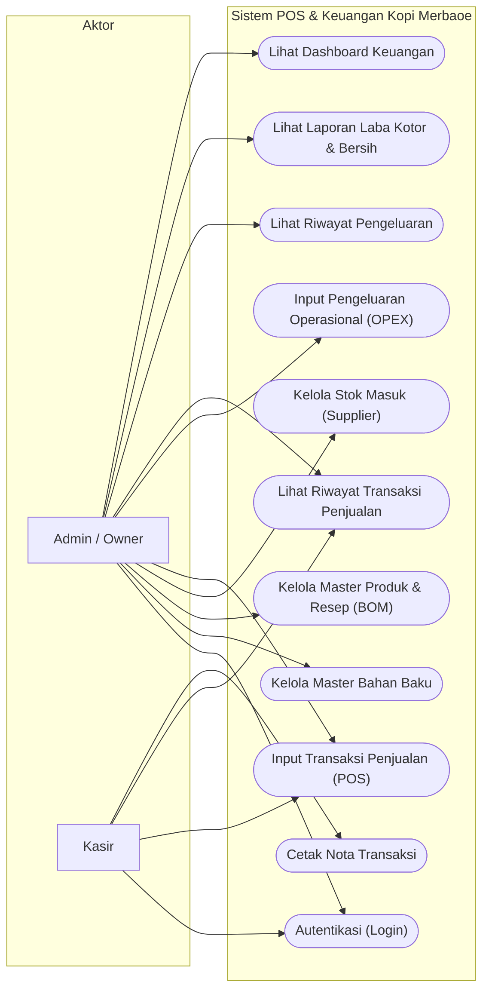
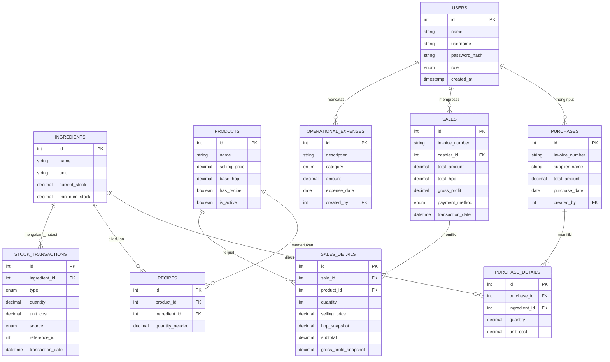
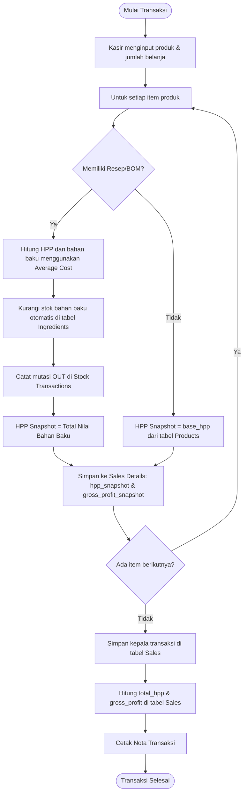
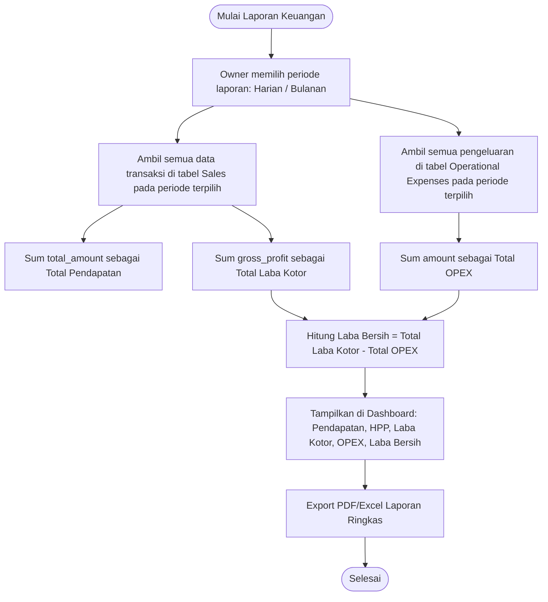

# DOKUMEN DESAIN SISTEM
## Rancang Bangun Aplikasi Web Pencatatan Transaksi & Analisis Laba (Kotor & Bersih)
### Studi Kasus: Kafe Kopi Merbaoe

---

## 1. PENDAHULUAN & RINGKASAN EKSEKUTIF

### 1.1 Latar Belakang
Kafe Kopi Merbaoe merupakan bisnis kuliner yang sedang berkembang. Dalam operasional sehari-hari, pencatatan transaksi penjualan, manajemen stok bahan baku, dan pemantauan pengeluaran operasional masih sering dilakukan secara manual atau terfragmentasi. Akibatnya, pemilik kafe (Owner) kesulitan dalam memantau kinerja keuangan secara *real-time*, khususnya terkait informasi **Laba Kotor (Gross Profit)** dan **Laba Bersih (Net Profit)**.

Untuk memenuhi kebutuhan akademis (Skripsi) sekaligus memberikan solusi bisnis yang konkret, dokumen ini merancang sebuah **Aplikasi Web Kasir (Point of Sale) & Analisis Keuangan** internal. Sistem ini terinspirasi dari fitur otomatisasi finansial pada platform **Olsera**, di mana HPP (Harga Pokok Penjualan) dipetakan secara dinamis berdasarkan pergerakan stok, dan laba dihitung secara otomatis saat transaksi terjadi.

### 1.2 Tujuan Dokumen Desain
Dokumen ini disusun untuk:
1. Menyediakan cetak biru (*blueprint*) arsitektur perangkat lunak dan basis data sistem.
2. Menjelaskan mekanisme matematis dan logis otomatisasi perhitungan Laba Kotor dan Laba Bersih.
3. Menjadi acuan bagi tim pengembang dalam tahap implementasi kode.

---

## 2. MATRIKS PERAN & KEBUTUHAN FUNGSIONAL

Sistem ini membagi aksesibilitas menjadi dua peran utama untuk menjaga integritas data keuangan:

| Fitur / Modul | Admin / Owner (Akses Penuh) | Kasir (Akses Terbatas) | Keterangan |
| :--- | :---: | :---: | :--- |
| **Autentikasi (Login/Logout)** | ✓ | ✓ | Menggunakan Auth berbasis Cookie Session / JWT. |
| **Kelola Master Bahan Baku** | ✓ | — | Menentukan stok minimal dan harga beli bahan baku. |
| **Kelola Master Menu/Produk** | ✓ | — | Mengatur harga jual, HPP statis, dan BOM (resep). |
| **Input Penjualan (POS)** | ✓ | ✓ | Kasir menginput item, jumlah, dan metode pembayaran. |
| **Input Pengeluaran Operasional** | ✓ | — | Pengeluaran non-stok terkait operasional toko (listrik, sewa, air, dll. di luar gaji). |
| **Lihat Riwayat Transaksi** | ✓ (Semua) | ✓ (Milik Sendiri) | Kasir hanya melihat transaksi yang diinput sendiri. |
| **Kelola Stok Masuk (Supplier)** | ✓ | — | Menambah kuantitas bahan baku beserta update harga beli. |
| **Lihat Stok Bahan Baku** | ✓ (Kelola) | ✓ (Hanya Baca) | Kasir dapat mengecek ketersediaan sebelum menjual. |
| **Laporan Laba Kotor & Bersih** | ✓ | — | Laporan periodik yang dapat difilter tanggal/bulan. |
| **Dashboard Ringkasan** | ✓ | — | Grafik tren pendapatan, pengeluaran, dan alert stok tipis. |

---

## 3. LOGIKA OTOMATISASI LABA (OLSERA-INSPIRED)

Fitur utama yang diadaptasi dari sistem manajemen retail modern (seperti Olsera) adalah **pelacakan biaya dinamis** untuk menghitung laba kotor dan bersih secara instan tanpa perlu rekonsiliasi manual di akhir bulan.

### 3.1 Perhitungan Laba Kotor (Gross Profit)
Laba kotor diperoleh dari selisih total pendapatan penjualan dengan Harga Pokok Penjualan (HPP) atau modal dari produk yang terjual.

$$\text{Laba Kotor} = \text{Pendapatan Penjualan} - \text{Total HPP (COGS)}$$

Di Kafe Kopi Merbaoe, HPP ditentukan menggunakan metode **Hybrid COGS**:
1. **Static HPP**: Jika produk tidak memiliki resep (misal: produk titipan/merchandise), nilai HPP diambil dari nominal statis yang ditentukan di master produk.
2. **Recipe-based Dynamic HPP (Bill of Materials - BOM)**: Jika produk didefinisikan memiliki resep (misal: Kopi Susu gula aren), nilai HPP dihitung dari akumulasi harga bahan baku pembentuknya menggunakan metode **Average Costing** (Rata-rata harga pembelian bahan baku).

#### Rumus HPP Dinamis Produk ($P$):
$$\text{HPP}_P = \sum_{i=1}^{n} (\text{Jumlah Bahan Baku}_i \times \text{Harga Rata-rata Beli Bahan Baku}_i)$$

#### Rumus Harga Rata-rata Beli Bahan Baku ($i$):
$$\text{Harga Rata-rata Beli}_i = \frac{\text{Total Nilai Stok Bahan Baku}_i}{\text{Total Kuantitas Stok Bahan Baku}_i}$$

> [!IMPORTANT]
> **Mekanisme HPP Snapshotting**
> Harga bahan baku berfluktuasi seiring waktu. Untuk menjaga keakuratan laporan keuangan historis, sistem **wajib** melakukan *snapshot* (pembekuan) nilai HPP pada tabel detail penjualan saat transaksi diselesaikan (`hpp_snapshot`). Jika di kemudian hari harga bahan baku naik, transaksi masa lalu tidak akan ikut berubah nilainya.

---

### 3.2 Perhitungan Laba Bersih (Net Profit)
Laba bersih diperoleh dengan mengurangkan Laba Kotor dengan seluruh pengeluaran operasional (Operational Expenses/OPEX) kafe pada periode tertentu.

$$\text{Laba Bersih} = \text{Laba Kotor} - \text{Total Pengeluaran Operasional (OPEX)}$$

#### Klasifikasi Pengeluaran Operasional (OPEX):
Sistem membagi pengeluaran non-stok menjadi beberapa kategori (sesuai permintaan klien, pengeluaran untuk gaji karyawan tidak dimasukkan ke dalam sistem agar lebih fokus pada pengeluaran dan pemasukan barang):
1. **Utilitas**: Tagihan bulanan listrik, air, Wi-Fi, dan sampah.
2. **Sewa Tempat**: Biaya sewa gedung (dapat diamortisasi bulanan).
3. **Pemeliharaan**: Perbaikan mesin kopi, penggantian lampu, dll.
4. **Operasional Lain-lain**: Biaya tak terduga seperti gelas pecah (*waste*), promosi/brosur, atau es batu kristal.

---

### 3.3 Simulasi Angka Perhitungan (Contoh Kasus)

#### A. Data Bahan Baku (Average Costing)
*   **Biji Kopi**: Stok 1.000 gram dengan total nilai Rp 150.000. (Rata-rata: **Rp 150 / gram**)
*   **Susu Fresh Milk**: Stok 2.000 ml dengan total nilai Rp 40.000. (Rata-rata: **Rp 20 / ml**)
*   **Gula Aren**: Stok 500 ml dengan total nilai Rp 15.000. (Rata-rata: **Rp 30 / ml**)

#### B. Resep Menu "Kopi Susu Aren" (BOM)
*   Biji Kopi: 15 gram $\rightarrow 15 \times 150 = \text{Rp } 2.250$
*   Susu Fresh Milk: 120 ml $\rightarrow 120 \times 20 = \text{Rp } 2.400$
*   Gula Aren: 20 ml $\rightarrow 20 \times 30 = \text{Rp } 600$
*   **Total HPP Dinamis Menu**: $\text{Rp } 2.250 + 2.400 + 600 = \textbf{Rp 5.250}$

#### C. Transaksi Penjualan
*   Menu: Kopi Susu Aren dijajakan seharga **Rp 18.000**.
*   Terjual: 10 cup.
*   **Total Pendapatan**: $10 \times 18.000 = \text{Rp } 180.000$
*   **Total HPP Terkunci (Snapshot)**: $10 \times 5.250 = \text{Rp } 52.500$
*   **Laba Kotor**: $\text{Rp } 180.000 - 52.500 = \textbf{Rp 127.500}$

#### D. Pengeluaran Operasional (Hari Terkait)
*   Pembayaran listrik harian proporsional: Rp 30.000
*   Beli es batu kristal (operasional): Rp 15.000
*   **Total OPEX**: $\text{Rp } 30.000 + 15.000 = \textbf{Rp 45.000}$

#### E. Laba Bersih Akhir Hari:
*   $\text{Laba Bersih} = \text{Laba Kotor} - \text{Total OPEX}$
*   $\text{Laba Bersih} = \text{Rp } 127.500 - 45.000 = \textbf{Rp 82.500}$

## 4. ARSITEKTUR TEKNOLOGI

Untuk skripsi berbasis web yang cepat selesai, memiliki performa tinggi, modern, dan mudah didemonstrasikan serta di-deploy secara gratis, direkomendasikan arsitektur berbasis Serverless dan Fullstack JavaScript/TypeScript dengan stack berikut:

*   **Frontend & Backend Framework**: **Next.js (App Router)** dengan **TypeScript**. Next.js bertindak sebagai fullstack framework di mana sisi *client-side* (UI Kasir/Dashboard) dan *server-side API routes* (logika perhitungan HPP, stok, dan autentikasi) terintegrasi dalam satu codebase. Hal ini mempercepat pengerjaan skripsi karena tidak perlu mengelola repositori frontend & backend secara terpisah.
*   **Database**: **PostgreSQL** yang di-host secara *cloud-managed* pada platform **Supabase** (Free Tier). Supabase menyediakan instance PostgreSQL relasional yang tangguh, mendukung transaksi, foreign keys, dan sangat cocok untuk konsistensi data pencatatan keuangan.
*   **Object-Relational Mapping (ORM)**: **Prisma ORM**. Digunakan sebagai jembatan relasi query antara Next.js dan PostgreSQL. Prisma menyediakan *auto-generated type safety* dari schema database ke kode TypeScript, serta mempermudah migrasi database menggunakan *Prisma Migrate*.
*   **Deployment & Hosting**: **Vercel** (untuk aplikasi Next.js) dan **Supabase Cloud** (untuk database). Keduanya memiliki integrasi otomatis (*CI/CD via GitHub*) dan menyediakan tingkat gratis (*Free Tier*) yang sangat memadai untuk demo skripsi dan uji coba klien secara langsung tanpa biaya server.
*   **Autentikasi**: **NextAuth.js** atau token JWT terenkripsi yang dikelola menggunakan middleware Next.js secara aman.

---

## 5. SKEMA BASIS DATA (DATABASE SCHEMA)

Berikut adalah struktur tabel basis data relasional yang didesain khusus agar mendukung otomatisasi finansial dan auditabilitas stok:

### 5.1 Tabel `users`
Menampung data akun pengguna sistem.
```sql
CREATE TABLE users (
    id INT PRIMARY KEY AUTO_INCREMENT,
    name VARCHAR(100) NOT NULL,
    username VARCHAR(50) UNIQUE NOT NULL,
    password_hash VARCHAR(255) NOT NULL,
    role ENUM('admin', 'kasir') NOT NULL,
    created_at TIMESTAMP DEFAULT CURRENT_TIMESTAMP,
    updated_at TIMESTAMP DEFAULT CURRENT_TIMESTAMP ON UPDATE CURRENT_TIMESTAMP
);
```

### 5.2 Tabel `ingredients` (Bahan Baku)
Menyimpan data stok mentah yang digunakan untuk meracik menu.
```sql
CREATE TABLE ingredients (
    id INT PRIMARY KEY AUTO_INCREMENT,
    name VARCHAR(100) NOT NULL,
    unit VARCHAR(20) NOT NULL, -- 'gram', 'ml', 'pcs', dll.
    current_stock DECIMAL(10, 2) DEFAULT 0.00,
    minimum_stock DECIMAL(10, 2) DEFAULT 100.00, -- threshold untuk notifikasi menipis
    created_at TIMESTAMP DEFAULT CURRENT_TIMESTAMP,
    updated_at TIMESTAMP DEFAULT CURRENT_TIMESTAMP ON UPDATE CURRENT_TIMESTAMP
);
```

### 5.3 Tabel `products` (Menu/Produk)
Menyimpan data produk yang dijual ke pelanggan.
```sql
CREATE TABLE products (
    id INT PRIMARY KEY AUTO_INCREMENT,
    name VARCHAR(100) NOT NULL,
    selling_price DECIMAL(10, 2) NOT NULL,
    base_hpp DECIMAL(10, 2) DEFAULT 0.00, -- Digunakan jika product tidak pakai resep (static HPP)
    has_recipe BOOLEAN DEFAULT FALSE,     -- Flag jika produk menggunakan resep bahan baku
    is_active BOOLEAN DEFAULT TRUE,
    created_at TIMESTAMP DEFAULT CURRENT_TIMESTAMP,
    updated_at TIMESTAMP DEFAULT CURRENT_TIMESTAMP ON UPDATE CURRENT_TIMESTAMP
);
```

### 5.4 Tabel `recipes` (BOM - Bill of Materials)
Menghubungkan produk dengan bahan baku penyusunnya (relasi Many-to-Many).
```sql
CREATE TABLE recipes (
    id INT PRIMARY KEY AUTO_INCREMENT,
    product_id INT NOT NULL,
    ingredient_id INT NOT NULL,
    quantity_needed DECIMAL(10, 2) NOT NULL, -- Jumlah yang dibutuhkan per porsi produk
    FOREIGN KEY (product_id) REFERENCES products(id) ON DELETE CASCADE,
    FOREIGN KEY (ingredient_id) REFERENCES ingredients(id) ON DELETE RESTRICT
);
```

### 5.5 Tabel `stock_transactions` (Kartu Stok & Costing)
Mencatat seluruh mutasi keluar masuk bahan baku demi penghitungan Average Costing.
```sql
CREATE TABLE stock_transactions (
    id INT PRIMARY KEY AUTO_INCREMENT,
    ingredient_id INT NOT NULL,
    type ENUM('in', 'out') NOT NULL,
    quantity DECIMAL(10, 2) NOT NULL,
    unit_cost DECIMAL(10, 2) DEFAULT 0.00, -- Harga beli per unit (hanya terisi jika type='in')
    source ENUM('purchase', 'sale', 'adjustment', 'waste') NOT NULL,
    reference_id INT DEFAULT NULL, -- Menunjuk ke ID purchase atau ID sale
    transaction_date DATETIME DEFAULT CURRENT_TIMESTAMP,
    FOREIGN KEY (ingredient_id) REFERENCES ingredients(id) ON DELETE CASCADE
);
```

### 5.6 Tabel `purchases` (Pengadaan Bahan Baku / Pengeluaran Stok)
Mencatat riwayat belanja bahan baku dari supplier.
```sql
CREATE TABLE purchases (
    id INT PRIMARY KEY AUTO_INCREMENT,
    invoice_number VARCHAR(50) UNIQUE NOT NULL,
    supplier_name VARCHAR(100) DEFAULT NULL,
    total_amount DECIMAL(10, 2) NOT NULL,
    purchase_date DATE NOT NULL,
    created_by INT NOT NULL,
    created_at TIMESTAMP DEFAULT CURRENT_TIMESTAMP,
    FOREIGN KEY (created_by) REFERENCES users(id)
);
```

### 5.7 Tabel `purchase_details`
Detail item bahan baku yang dibeli dalam satu invoice pembelian.
```sql
CREATE TABLE purchase_details (
    id INT PRIMARY KEY AUTO_INCREMENT,
    purchase_id INT NOT NULL,
    ingredient_id INT NOT NULL,
    quantity DECIMAL(10, 2) NOT NULL,
    unit_cost DECIMAL(10, 2) NOT NULL,
    FOREIGN KEY (purchase_id) REFERENCES purchases(id) ON DELETE CASCADE,
    FOREIGN KEY (ingredient_id) REFERENCES ingredients(id)
);
```

### 5.8 Tabel `sales` (Transaksi Penjualan / Pemasukan)
Mencatat kepala transaksi penjualan.
```sql
CREATE TABLE sales (
    id INT PRIMARY KEY AUTO_INCREMENT,
    invoice_number VARCHAR(50) UNIQUE NOT NULL,
    cashier_id INT NOT NULL,
    total_amount DECIMAL(10, 2) NOT NULL, -- Total yang dibayarkan pelanggan
    total_hpp DECIMAL(10, 2) NOT NULL,    -- Total modal terkunci dari seluruh item
    gross_profit DECIMAL(10, 2) NOT NULL, -- total_amount - total_hpp
    payment_method ENUM('cash', 'qris', 'transfer') NOT NULL,
    transaction_date DATETIME DEFAULT CURRENT_TIMESTAMP,
    FOREIGN KEY (cashier_id) REFERENCES users(id)
);
```

### 5.9 Tabel `sales_details`
Menyimpan detail produk yang dibeli beserta *snapshot* biaya modal.
```sql
CREATE TABLE sales_details (
    id INT PRIMARY KEY AUTO_INCREMENT,
    sale_id INT NOT NULL,
    product_id INT NOT NULL,
    quantity INT NOT NULL,
    selling_price DECIMAL(10, 2) NOT NULL,
    hpp_snapshot DECIMAL(10, 2) NOT NULL, -- HPP item saat transaksi terjadi (TERKUNCI)
    subtotal DECIMAL(10, 2) NOT NULL,
    gross_profit_snapshot DECIMAL(10, 2) NOT NULL, -- (selling_price - hpp_snapshot) * qty
    FOREIGN KEY (sale_id) REFERENCES sales(id) ON DELETE CASCADE,
    FOREIGN KEY (product_id) REFERENCES products(id)
);
```

### 5.10 Tabel `operational_expenses` (Pengeluaran Operasional)
Mencatat beban biaya harian/bulanan di luar pembelian bahan baku.
```sql
CREATE TABLE operational_expenses (
    id INT PRIMARY KEY AUTO_INCREMENT,
    description VARCHAR(255) NOT NULL,
    category ENUM('utilitas', 'sewa', 'pemeliharaan', 'lain_lain') NOT NULL,
    amount DECIMAL(10, 2) NOT NULL,
    expense_date DATE NOT NULL,
    created_by INT NOT NULL,
    created_at TIMESTAMP DEFAULT CURRENT_TIMESTAMP,
    FOREIGN KEY (created_by) REFERENCES users(id)
);
```

### 5.11 Prisma Schema Model (`schema.prisma`)
Berikut konfigurasi Prisma Schema yang merepresentasikan skema basis data PostgreSQL di atas untuk diintegrasikan pada Next.js:

```prisma
datasource db {
  provider = "postgresql"
  url      = env("DATABASE_URL")
}

generator client {
  provider = "prisma-client-js"
}

enum Role {
  admin
  kasir
}

enum PaymentMethod {
  cash
  qris
  transfer
}

enum ExpenseCategory {
  utilitas
  sewa
  pemeliharaan
  lain_lain
}

enum TransactionType {
  in
  out
}

enum StockSource {
  purchase
  sale
  adjustment
  waste
}

model User {
  id                  Int                  @id @default(autoincrement())
  name                String               @db.VarChar(100)
  username            String               @unique @db.VarChar(50)
  passwordHash        String               @map("password_hash") @db.VarChar(255)
  role                Role
  createdAt           DateTime             @default(now()) @map("created_at")
  updatedAt           DateTime             @updatedAt @map("updated_at")
  purchases           Purchase[]
  sales               Sale[]
  operationalExpenses OperationalExpense[]

  @@map("users")
}

model Ingredient {
  id                Int                @id @default(autoincrement())
  name              String             @db.VarChar(100)
  unit              String             @db.VarChar(20)
  currentStock      Decimal            @default(0.00) @map("current_stock") @db.Decimal(10, 2)
  minimumStock      Decimal            @default(100.00) @map("minimum_stock") @db.Decimal(10, 2)
  createdAt         DateTime           @default(now()) @map("created_at")
  updatedAt         DateTime           @updatedAt @map("updated_at")
  recipes           Recipe[]
  purchaseDetails   PurchaseDetail[]
  stockTransactions StockTransaction[]

  @@map("ingredients")
}

model Product {
  id           Int           @id @default(autoincrement())
  name         String        @db.VarChar(100)
  sellingPrice Decimal       @map("selling_price") @db.Decimal(10, 2)
  baseHpp      Decimal       @default(0.00) @map("base_hpp") @db.Decimal(10, 2)
  hasRecipe    Boolean       @default(false) @map("has_recipe")
  isActive     Boolean       @default(true) @map("is_active")
  createdAt    DateTime      @default(now()) @map("created_at")
  updatedAt    DateTime      @updatedAt @map("updated_at")
  recipes      Recipe[]
  salesDetails SaleDetail[]

  @@map("products")
}

model Recipe {
  id             Int        @id @default(autoincrement())
  productId      Int        @map("product_id")
  ingredientId   Int        @map("ingredient_id")
  quantityNeeded Decimal    @map("quantity_needed") @db.Decimal(10, 2)
  product        Product    @relation(fields: [productId], references: [id], onDelete: Cascade)
  ingredient     Ingredient @relation(fields: [ingredientId], references: [id], onDelete: Restrict)

  @@map("recipes")
}

model StockTransaction {
  id              Int             @id @default(autoincrement())
  ingredientId    Int             @map("ingredient_id")
  type            TransactionType
  quantity        Decimal         @db.Decimal(10, 2)
  unitCost        Decimal         @default(0.00) @map("unit_cost") @db.Decimal(10, 2)
  source          StockSource
  referenceId     Int?            @map("reference_id")
  transactionDate DateTime        @default(now()) @map("transaction_date")
  ingredient      Ingredient      @relation(fields: [ingredientId], references: [id], onDelete: Cascade)

  @@map("stock_transactions")
}

model Purchase {
  id            Int              @id @default(autoincrement())
  invoiceNumber String           @unique @map("invoice_number") @db.VarChar(50)
  supplierName  String?          @map("supplier_name") @db.VarChar(100)
  totalAmount   Decimal          @map("total_amount") @db.Decimal(10, 2)
  purchaseDate  DateTime         @map("purchase_date") @db.Date
  createdBy     Int              @map("created_by")
  createdAt     DateTime         @default(now()) @map("created_at")
  user          User             @relation(fields: [createdBy], references: [id])
  details       PurchaseDetail[]

  @@map("purchases")
}

model PurchaseDetail {
  id           Int        @id @default(autoincrement())
  purchaseId   Int        @map("purchase_id")
  ingredientId Int        @map("ingredient_id")
  quantity     Decimal    @db.Decimal(10, 2)
  unitCost     Decimal    @map("unit_cost") @db.Decimal(10, 2)
  purchase     Purchase   @relation(fields: [purchaseId], references: [id], onDelete: Cascade)
  ingredient   Ingredient @relation(fields: [ingredientId], references: [id])

  @@map("purchase_details")
}

model Sale {
  id              Int          @id @default(autoincrement())
  invoiceNumber   String       @unique @map("invoice_number") @db.VarChar(50)
  cashierId       Int          @map("cashier_id")
  totalAmount     Decimal      @map("total_amount") @db.Decimal(10, 2)
  totalHpp        Decimal      @map("total_hpp") @db.Decimal(10, 2)
  grossProfit     Decimal      @map("gross_profit") @db.Decimal(10, 2)
  paymentMethod   PaymentMethod @map("payment_method")
  transactionDate DateTime     @default(now()) @map("transaction_date")
  user            User         @relation(fields: [cashierId], references: [id])
  details         SaleDetail[]

  @@map("sales")
}

model SaleDetail {
  id                  Int     @id @default(autoincrement())
  saleId              Int     @map("sale_id")
  productId           Int     @map("product_id")
  quantity            Int
  sellingPrice        Decimal @map("selling_price") @db.Decimal(10, 2)
  hppSnapshot         Decimal @map("hpp_snapshot") @db.Decimal(10, 2)
  subtotal            Decimal @db.Decimal(10, 2)
  grossProfitSnapshot Decimal @map("gross_profit_snapshot") @db.Decimal(10, 2)
  sale                Sale    @relation(fields: [saleId], references: [id], onDelete: Cascade)
  product             Product @relation(fields: [productId], references: [id])

  @@map("sales_details")
}

model OperationalExpense {
  id          Int             @id @default(autoincrement())
  description String          @db.VarChar(255)
  category    ExpenseCategory
  amount      Decimal         @db.Decimal(10, 2)
  expenseDate DateTime        @map("expense_date") @db.Date
  createdBy   Int             @map("created_by")
  createdAt   DateTime        @default(now()) @map("created_at")
  user        User            @relation(fields: [createdBy], references: [id])

  @@map("operational_expenses")
}
```

---

## 6. DIAGRAM SISTEM (MERMAID)

### 6.1 Diagram Use Case (Peran & Fitur)
Menggambarkan interaksi aktor (Admin/Owner dan Kasir) terhadap fitur-fitur aplikasi.



---

### 6.2 Entity Relationship Diagram (ERD)
Memperlihatkan hubungan logis antar tabel beserta Foreign Key dan tipe datanya.



---

### 6.3 Flowchart: Transaksi & Otomatisasi Perhitungan Laba Kotor
Alur proses kasir saat memproses transaksi penjualan, pengurangan stok bahan baku, pengambilan snapshot HPP, dan penyimpanan nominal laba kotor.



---

### 6.4 Flowchart: Pencatatan Pengeluaran & Analisis Laba Bersih
Alur pemrosesan Laba Bersih yang diakses oleh Owner melalui penyaringan waktu (periodik harian/bulanan).



---

## 7. FITUR TAMBAHAN STANDAR POS PROPER (OLSERA-STYLE)

Untuk menaikkan nilai jual akademis skripsi dan memberikan performa aplikasi kasir yang tangguh, sistem ini juga dilengkapi dengan mekanisme berikut:

1.  **Safety Stock Alert (Pemberitahuan Stok Tipis)**:
    *   Jika `current_stock` pada bahan baku lebih kecil atau sama dengan `minimum_stock`, sistem akan menampilkan indikator warna merah di dashboard admin dan kasir agar segera melakukan *re-stock*.
2.  **Pencegahan Transaksi jika Stok Kosong (Out of Stock Block)**:
    *   Kasir tidak diperkenankan melanjutkan transaksi jika jumlah bahan baku resep tidak mencukupi untuk membuat menu tersebut, menghindari kesalahan penjualan di lapangan.
3.  **Audit Trail Mutasi Stok (Kartu Stok)**:
    *   Setiap kali ada pengeluaran atau pemasukan stok, tabel `stock_transactions` mencatat riwayat kronologis secara detail. Owner dapat menelusuri selisih stok jika terjadi ketidakcocokan fisik di kafe.
4.  **Fleksibilitas Pembayaran**:
    *   Sistem mendukung pencatatan metode pembayaran Tunai (Cash), QRIS, atau Transfer Bank, yang nantinya penting bagi analisis kas harian Owner.
